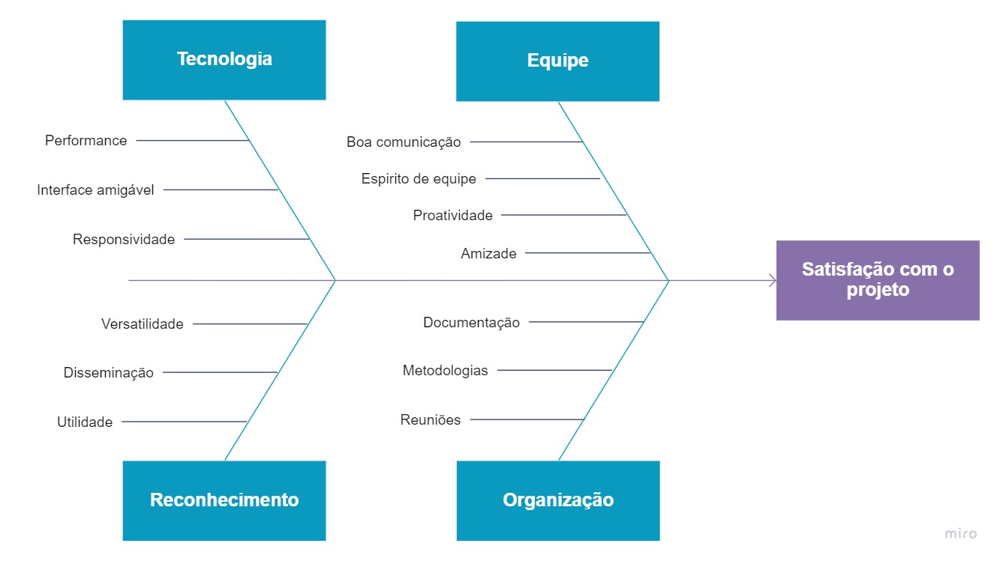

# Diagrama de Ishkawa

| Data |Versão| Autor | Descrição |
| ---- | ---- | ----- | --------- |
| 2020/08/30 | 1.0 | Dâmaso | Criação do diagrama de ishkawa |
| 2020/09/12 | 1.1 | Eduardo Luís | Criação do segundo diagrama de ishkawa |

 Foi desenvolvido a primeira versão que visava avaliar o problema "Lembrar receitas" que foi uma das premissas para a escolha do tema do projeto 

Autor: Dâmaso Júnio

Autor: Eduardo Lima e Luís Henrique

## Referências

[1] ANDRADE, Luiza. **Diagrama de Ishkawa: O que é e como fazer**, 2017. Disponível em: <<www.siteware.com.br/metodologias/diagrama-de-ishkawa>>. Acesso em: 30, Agosto, 2020.
