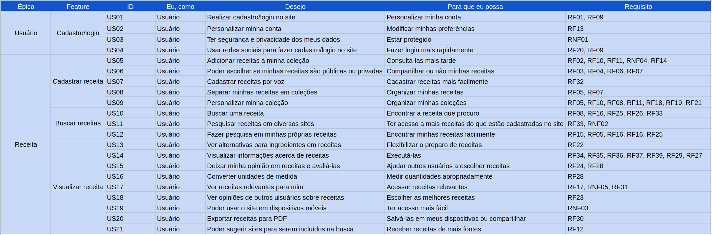

# Backlog do Produto

| Data |Versão| Autor | Descrição |
| ---- | ---- | ----- | --------- |
| 2020/09/09 | 1.0 | Luís, Eduardo e Samuel | Adicionando backlog |
| 2020/09/15 | 2.0 | Dâmaso e Samuel |Atualizando backlog|

## Backlog v1

## Backlog v2

|Épicos|Features| User Story|[Requisitos de origem](02-requisitos/elicitacao/tabela_requisitos.md)|
|------|--------|-----------|--------|
|**EP01 - Usuário**|**FE01 - Autenticação**|**US01:** Eu, como usuário, gostaria de realizar o cadastro / login no site para ter pleno acesso às funcionalidades.|RF01, RF09|
| | |**US02:** Eu, como usuário, gostaria de deletar a minha conta no site para cancelar o meu uso no site.|RF13|
|||**US03:** Eu, como usuário, gostaria de usar as redes sociais para fazer o cadastro / login no site para facilitar o processo de autenticação.|RF01, RF20|
|||**US04:** Eu, como usuário, gostaria de editar a minha conta para atualizar as minhas informações de autenticação.|RF13|
||**FE02 - Perfil**|**US05:** Eu, como usuário, gostaria de editar meu perfil para poder atualizar minhas informações pessoais.|RF13|
||**FE03 - Feedback**|**US06:** Eu, como usuário, gostaria de fornecer sugestões de sites a serem incluídos em pesquisas para obter resultados com maior variedade.|RF12|
|||**US07:** Eu, como usuário, gostaria de fornecer feedback para a melhoria do site.|N/A|
|**EP02 - Receitas**|**FE04 - Criação**|**US08:** Eu, como usuário, gostaria de cadastrar receitas para poder armazená-las em meu perfil.|RF02|
|||**US09:** Eu, como usuário, gostaria de deletar receitas da minha conta para poder retirá-las do site.|RF18|
|||**US10:** Eu, como usuário, gostaria de editar as minhas receitas para poder atualizar o conteúdo delas.|RF19|
|||**US11:** Eu, como usuário, gostaria de cadastrar minhas receitas por voz para conseguir utilizar o site de formas mais diversas.|RF32|
||**FE05 - Busca**|**US12:** Eu, como usuário, gostaria de buscar uma receita para obter informações acerca do preparo da mesma.|RF08, RF25, RF26, RF33|
|||**US13:** Eu, como usuário, gostaria de buscar uma receita no próprio site para ter um acesso a informações delas.|RF08, RF25, RF26, RF33|
|||**US14:** Eu, como usuário, gostaria de buscar receitas em minhas conta para ter maior facilidade em achar as suas informações.|RF08, RF25, RF26, RF33|
|||**US15:** Eu, como usuário, gostaria de adicionar ingredientes alternativos para as receitas para que as pessoas possam flexibilizar o seu preparo.|RF21|
||**FE06 - Visualização**|**US16:** Eu, como usuário, gostaria de visualizar receitas para que eu possa ter acesso às informações delas.|RF29, RF34, RF35, RF36, RF37, RF39|
|||**US17:** Eu, como usuário, gostaria de deixar minha opinião em receitas e avaliá-las para que outros usuários possam ver a qualidade da receita.|RF24, RF28|
|||**US18:** Eu, como usuário, gostaria de conseguir ver opções de conversão de medidas para melhor executar as receitas.|RF27|
|||**US19:** Eu, como usuário, gostaria de poder ver alternativas para ingredientes para poder flexibilizar o preparo das receitas.|RF22, RF29|
||**FE07 - Compartilhamento**|**US20:** Eu, como usuário, gostaria de colocar uma receita como pública para tê-la visível ao público.|RF02, RF04|
|||**US21:** Eu, como usuário, gostaria de colocar uma receita como privada para mantê-la visível somente à minha conta ou contas autorizadas.|RF02, RF03|
|||**US22:** Eu, como usuário, gostaria de exportar minhas receitas em formato PDF para poder compartilhá-las.|RF30|
||**FE08 - Categorização**|**US23:** Eu, como usuário, gostaria de atribuir categorias à receitas para organizar as receitas em minha conta.|RF14, RF16, RF33|
|**EP03 - Livro de receitas**|**FE09 - Criação**|**US24:** Eu, como usuário, gostaria de adicionar receitas em meus livros de receitas para ter como organizar minhas receitas como eu bem quiser.|RF10, RF11, RNF04|
|||**US25:** Eu, como usuário, gostaria de deletar meus livros de receitas da minha conta para poder retirá-los do site.|RF18|
|||**US26:** Eu, como usuário, gostaria de editar os meus livros para poder atualizar o conteúdo deles.|RF19|
|||**US27:** Eu, como usuário, gostaria de deletar as receitas do meu livro de receitas para poder atualizar o conteúdo deles.|RF18|
||**FE10 - Busca**|**US28:** Eu, como usuário, gostaria de buscar um livro de receitas no próprio site para obter receitas dentro de um mesmo domínio.|RF08, RF15, RF16 |
|||**US29:** Eu, como usuário, gostaria de buscar receitas em meus livros para ter maior facilidade em achar as minhas receitas.|RF16, RF25, RF26, RF33|
||**FE11 - Visualização**|**US30:** Eu, como usuário, gostaria de visualizar livros de receitas para que eu possa ter acesso às informações deles|RF29|
|||**US31:** Eu, como usuário, gostaria de deixar minha opinião em livros de receitas e avaliá-los para que outros usuários possam ver o engajamento sobre o livro.|RF24, RF28|
||**FE12 - Compartilhamento**|**US32:** Eu, como usuário, gostaria de colocar um livro como público para tê-lo visível ao público.|RF07|
|||**US33:** Eu, como usuário, gostaria de colocar um livro como privado para mantê-lo visível somente à minha conta ou contas autorizadas.|RF07|
|||**US34:** Eu, como usuário, gostaria de exportar meu livros em formato PDF para poder compartilhá-los.|RF07, RF30|

## Referências

[1] YELLOW, Requisitos. **Ágil**, 2019. Disponível em: <<https://yellow.netlify.app/modelagem/agil_v2/>>. Acesso em: 15, Setembro, 2020.