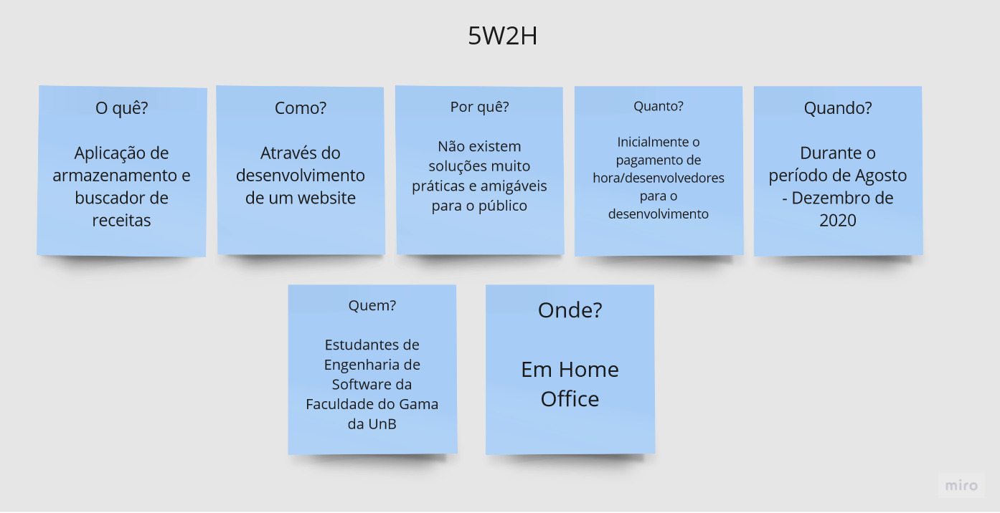

# 5W2H

| Data |Versão| Autor | Descrição |
| ---- | ---- | ----- | --------- |
| 2020/08/30 | 1.0 | Dâmaso | Criação do 5W2H |

 Foi criado o 5W2H para a definição mais formal e completa do projeto em seu escopo mais geral, para que todos da equipe possam ficar alinhados com o desenvolvimento e o que se espera dele 

Autor: Dâmaso Júnio

## Referências

[1] **5W2H**, 2019. Disponível em: <<https://yellow.netlify.app/elicitacao/02-requisitos/5w2h_v1/>>. Acesso em: 30, Agosto, 2020.
