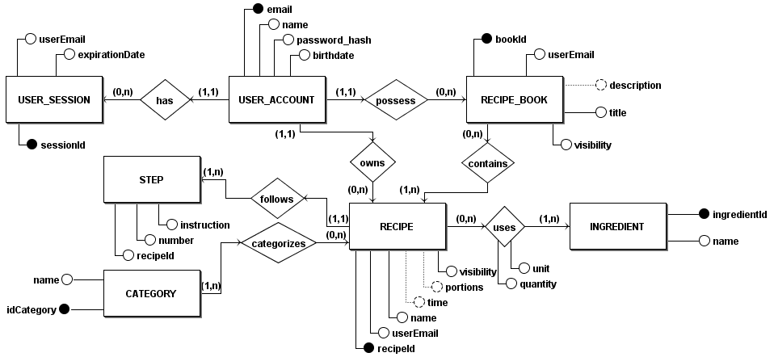
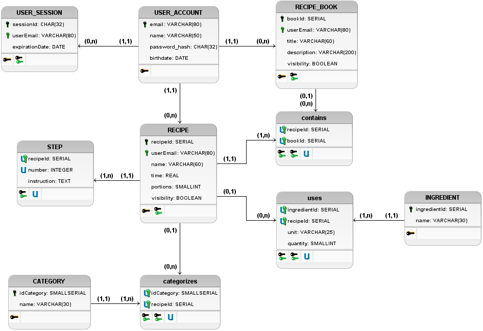

# Base de Dados
| Data |Versão| Autor | Descrição |
| ---- | ---- | ----- | --------- |
| 2020/09/22 | 0.1 | Samuel Pereira | Adição do ME-R |
| 2020/09/23 | 0.2 | Samuel Pereira | Atualizações do ME-R e adição do DE-R |
| 2020/09/23 | 0.3 | Samuel Pereira | Atualizações do DE-R, adição do Diagrama Lógico e mudança de título |
| 2020/09/23 | 1.0 | Samuel Pereira | Adição de visibility em RECIPE_BOOK |
| 2020/09/24 | 1.1 | Samuel Pereira | Modificação do nome de tabela USER |

## ME-R

### Entidades
&emsp;USER_ACCOUNT 
&emsp;RECIPE 
&emsp;RECIPE_BOOK 
&emsp;USER_SESSION 
&emsp;CATEGORY 
&emsp;STEP 
&emsp;INGREDIENT 

### Atributos
&emsp;USER_ACCOUNT(<u>email</u>, name, password_hash, birthdate) 
&emsp;RECIPE(<u>recipeId</u>, userEmail, name, time, portions, visibility) 
&emsp;RECIPE_BOOK(<u>bookId</u>, userEmail, title, description, visibility) 
&emsp;USER_SESSION(userEmail, <u>sessionId</u>, expirationDate) 
&emsp;CATEGORY(<u>idCategory</u>, name) 
&emsp;STEP(recipeId, number, instruction) 
&emsp;INGREDIENT(<u>ingredientId</u>, name) 

### Relacionamentos
&emsp;USER_ACCOUNT - has - USER_SESSION 
&emsp;&emsp;Uma USER ACCOUNT pode ter múltiplas USER SESSIONS e uma USER SESSION só pode ser tida por uma única USER ACCOUNT. 
&emsp;&emsp;Cardinalidade: 1:n. 
 
&emsp;USER_ACCOUNT - owns - RECIPE 
&emsp;&emsp;Uma USER ACCOUNT pode possuir múltiplos RECIPES e um RECIPE só pode ser possuído por uma única USER ACCOUNT. 
&emsp;&emsp;Cardinalidade: 1:n. 
 
&emsp;USER_ACCOUNT - possess - RECIPE_BOOK 
&emsp;&emsp;Uma USER ACCOUNT pode possuir múltiplos RECIPE BOOKS e um RECIPE BOOK só pode ser possuído por uma única USER ACCOUNT. 
&emsp;&emsp;Cardinalidade: 1:n. 
 
&emsp;RECIPE - uses - INGREDIENT 
&emsp;&emsp;Um RECIPE usa um ou mais INGREDIENTS e um INGREDIENT pode ser usado em várias RECIPES. 
&emsp;&emsp;Cardinalidade: n:m. 
 
&emsp;RECIPE - follows - STEPS 
&emsp;&emsp;Um RECIPE segue um ou mais STEPS e um STEP é seguido somente por um RECIPE. 
&emsp;&emsp;Cardinalidade: 1:n. 
 
&emsp;RECIPE_BOOK - contains - RECIPE 
&emsp;&emsp;Um RECIPE BOOK contém um ou mais RECIPES e um RECIPE pode estar contido em vários RECIPE BOOKS. 
&emsp;&emsp;Cardinalidade: n:m. 
 
&emsp;CATEGORY - categorizes - RECIPE 
&emsp;&emsp;Uma CATEGORY pode categorizar vários RECIPES e um RECIPE pode ser categorizado por múltiplas CATEGORIES. 
&emsp;&emsp;Cardinalidade: n:m. 

## DE-R

## Diagrama Lógico
