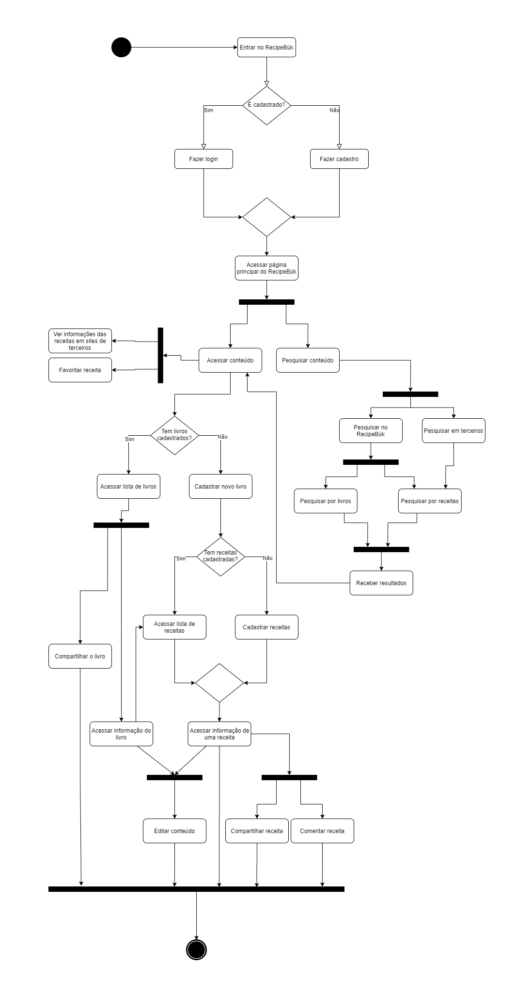

| Data |Versão| Autor | Descrição |
| ---- | ---- | ----- | --------- |
| 2020/09/24 | 0.1 | Dâmaso e Samuel | Criação do Documento |
| 2020/09/27 | 1.0 | Dâmaso e Samuel | Adição do documento à Wiki |

# Diagrama de Atividades

Autor: Dâmaso Júnio e Samuel Pereira

# Referências

[1] Activity Diagram. Disponível em: <<https://www.uml-diagrams.org/activity-diagrams.html>>. Acesso em: 24 set. 2020.

[2] Aula 06c - Modelagem - Atividades. Disponível em <<https://unbbr-my.sharepoint.com/:v:/g/personal/mileneserrano_unb_br/Ed9k-OvMH7hMlNMj6CGVenMBSyeVrDBOdg84Czx_aHI9gw?e=ZzFF4A>>. Acesso em: 23 set. 2020.