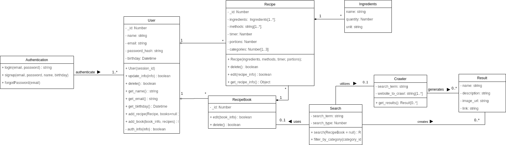

| Data |Versão| Autor | Descrição |
| ---- | ---- | ----- | --------- |
| 2020/09/18 | 1.0 | Dâmaso e Samuel | Adição do documento à wiki |
| 2020/09/28 | 1.1  | Dâmaso | Adição da descrição do diagrama de classes |

# Diagrama de Classes

O Diagrama de Classes foi desenvolvido em nosso contexto com o objetivo de explicitar as relações entre as classes e objetos dentro do desenvolvimento do projeto. Nele podemos ver as principais classes e suas relações, como User, Recipe, RecipeBook e também Search. Que são as classes chave para todo o nosso projeto, mostrando também suas dependências e seus retornos. 

Autor: Dâmaso Júnio e Samuel Pereira

# Referências

[1] UML Class and Object Diagrams Overview. Disponível em: <<https://www.uml-diagrams.org/class-diagrams-overview.html>>. Acesso em: 16 set. 2020.

[2] Hospital Management: UML Class Diagram Example. Disponível em: <<https://www.uml-diagrams.org/examples/hospital-domain-diagram.html>>. Acesso em: 16 set. 2020.
