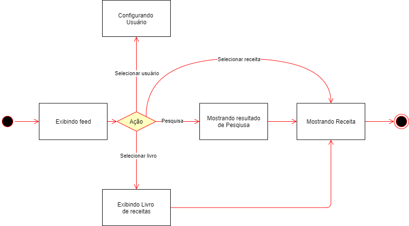

| Data |Versão| Autor | Descrição |
| ---- | ---- | ----- | --------- |
| 2020/09/25 | 1.0 | Eduardo, Luis | Inclusão do diagrama de estados |
| 2020/09/28 | 1.1 | Larissa Sales | Inclusão de descrição |

# Diagrama de Estados

O Diagrama de Estado tem como função modelar os diversos estados de um objeto durante o seu ciclo de vida. Eles representam uma alternativa ao diagrama de casos de uso que, em geral, são utilizados durante a etapa de análise do sistema, enquanto os diagramas de estados são utilizados durante a etapa de projeto do sistema.  

Esse modelo de diagrama é utilizado para definir o comportamento dependente do estado ou o comportamento que varia de acordo com o estado em que está o elemento observado. O diagrama de estados, então, serve para modelar o comportamento de classes ativas que usam eventos de chamada e de sinal para implementar suas operações.

Autor: Eduardo Lima, Luís Taira

[1] UML State Machine Diagrams. Disponível em: <<https://www.uml-diagrams.org/state-machine-diagrams.html>>. Acesso em: 25 set. 2020.

[2] Diretriz: Diagrama de Estados. Disponível em: <<https://www.cin.ufpe.br/~gta/rup-vc/core.base_rup/guidances/guidelines/statechart_diagram_640B5D0B.html>>. Acesso em: 28 set. 2020.

[3] ABDALA, Daniel. Diagrama de Estados. Disponível em: <<http://www.facom.ufu.br/~abdala/DAS5312/Diagrama%20de%20Estados.pdf>>. Acesso em: 28 set. 2020.