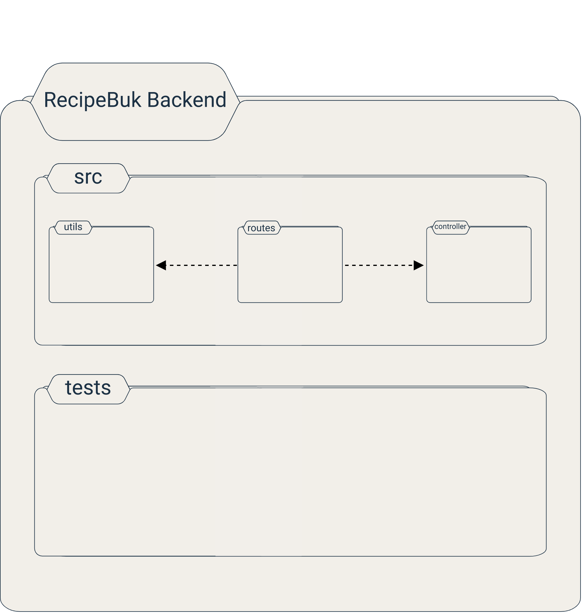
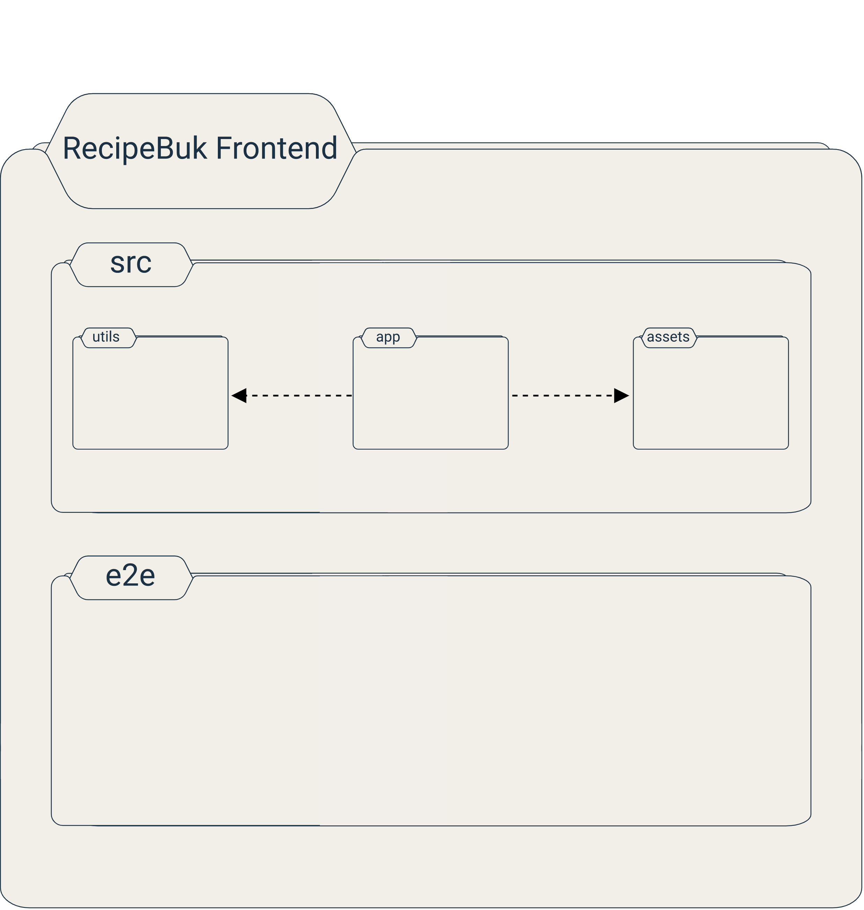

| Data |Versão| Autor | Descrição |
| ---- | ---- | ----- | --------- |
| 2020/09/15 | 0.1 | Eduardo Vieira e Luis Taira | Criação do Documento |

# Diagrama de Pacotes

Autor: Eduardo Vieira e Luis Taira

# Referências

[1] Tudo sobre diagramas de pacotes UML. Disponível em: <<https://www.lucidchart.com/pages/pt/diagrama-de-pacotes-uml>>. Acesso em: 17 set. 2020.

[2] Gaia - Documento de arquitetura. Disponível em: <<https://fga-eps-mds.github.io/2019.1-Gaia/#/projeto/DocArquitetura>>. Acesso em: 17 set. 2020.

