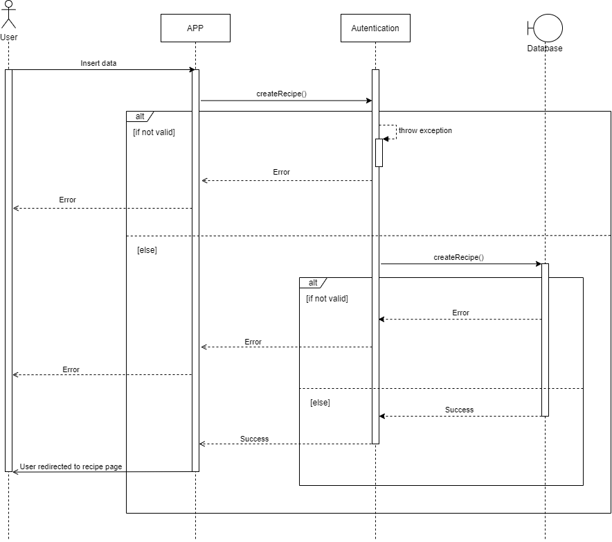
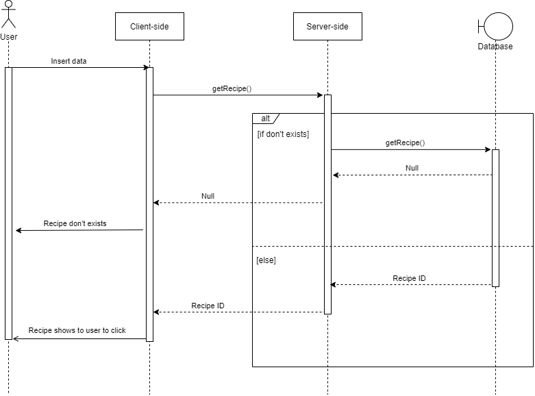

| Data |Versão| Autor | Descrição |
| ---- | ---- | ----- | --------- |
| 2020/09/24 | 0.1 | Larissa Sales e Letícia Araújo | Criação do Documento |
| 2020/09/24 | 1.0 | Larissa Sales | Inclusão dos diagramas de cadastro e busca de receita |
| 2020/09/28 | 1.1 | Larissa Sales | Inclusão de descrição |

# Diagrama de Sequência

O Diagrama de Sequência é bastante utilizado para modelar as interações entre os objetos em um caso de uso. Ele leva esse nome por se organizar de acordo com a ordem em que essas interações ocorrem. 

Para este projeto, foi entendido pelo time que as sequências de maior importância seriam: Cadastro e Login de Usuário ([US01](https://www.recipebukdocs.tk/#/02-requisitos/priorizacao/backlog)) e Cadastro de Receita ([US08](https://www.recipebukdocs.tk/#/02-requisitos/priorizacao/backlog)).

## Cadastro de usuário

Autor: Larissa Sales

## Login de usuário

Autor: Larissa Sales

## Cadastro de receita

Autor: Larissa Sales

## Busca de receita

Autor: Larissa Sales

# Referências

[1] Sequence Diagram Tutorial: Complete Guide with Examples. Disponível em: <<https://creately.com/blog/diagrams/sequence-diagram-tutorial/>>. Acesso em: 23 set. 2020.

[2] UML Sequence Diagrams. Disponível em: <<https://www.uml-diagrams.org/sequence-diagrams.html>>. Acesso em: 23 set. 2020.