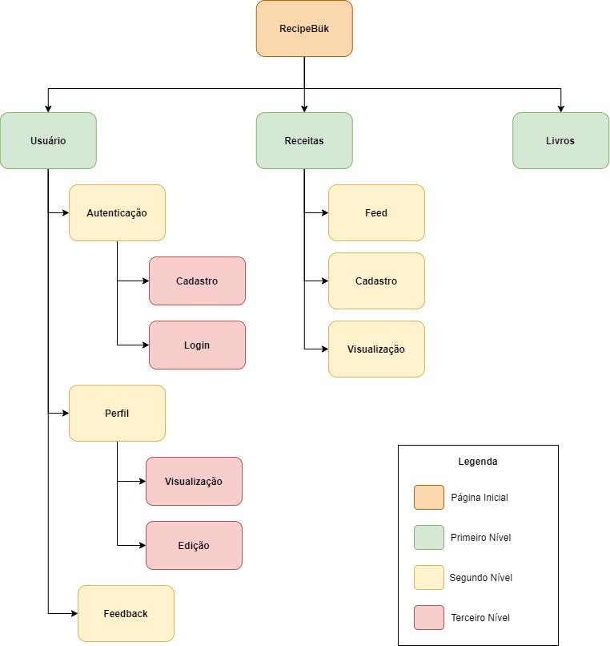

| Data |Versão| Autor | Descrição |
| ---- | ---- | ----- | --------- |
| 2020/09/17 | 0.1 | Larissa Sales e Letícia Araújo | Criação do Documento |

# Fluxo de Navegação

O Fluxo de Navegação é uma visão de baixo nível que nos permite mapear todo fluxo de telas da aplicação de forma rápida, ajudando a encontrar as direções para ir de um ponto a outro. Esta técnica serve também para analisar a eficiência de tarefas olhando pelo lado da experiência de usuário e é uma ótima base para a prototipagem do sistema.

Autor: Larissa Sales e Letícia Araújo

# Referências

[1] DUTRA, Rian. Sitemap e User Flow: Quais as Diferenças e Quando Usar Cada Um. Disponível: <<http://designr.com.br/sitemap-e-user-flow-quais-as-diferencas-e-quando-usar-cada-um/>>. Acesso em: 17 set. 2020.

[2] FARIAS, Gabriel. Fluxo de usuário (User Flow): O que é? Como fazer?. Disponível: <<https://medium.com/7bits/fluxo-de-usu%C3%A1rio-user-flow-o-que-%C3%A9-como-fazer-79d965872534>>. Acesso em: 17 set. 2020.

[3] TEXEIRA, Fabrício. Os entregáveis da Arquitetura de Informação. Disponível: <<https://brasil.uxdesign.cc/os-entreg%C3%A1veis-da-arquitetura-de-informa%C3%A7%C3%A3o-ff03baf3ba45>>. Acesso em: 17 set. 2020.