| Data |Versão| Autor | Descrição |
| ---- | ---- | ----- | --------- |
| 2020/11/14 | 1.0 | Dâmaso e Letícia | Criação do Documento |
| 2020/11/15 | 1.1 | Dâmaso e Letícia | Adicionando diagramas |

# Estudo Dirigido - GoFs Comportamental

O padrão de comportamento se concentra no algoritmo e na atribuição de responsabilidades entre os objetos. Eles não apenas descrevem os padrões de objetos ou classes, mas também os padrões de comunicação entre os objetos. O modelo de comportamento de classe usa herança para distribuir comportamento entre classes, enquanto o modelo de comportamento de objeto usa composição de objeto como recompensa pela herança.

## Chain of Responsibility

A principal função é evitar a dependência entre um objeto receptor e um objeto solicitante. Consiste em uma série de objetos receptores e de objetos de solicitação, onde cada objetos de solicitação possui uma lógica interna que separa quais são tipos de objetos receptores que podem ser manipulados. O restante é passado para o próximo objetos de solicitação da cadeia.

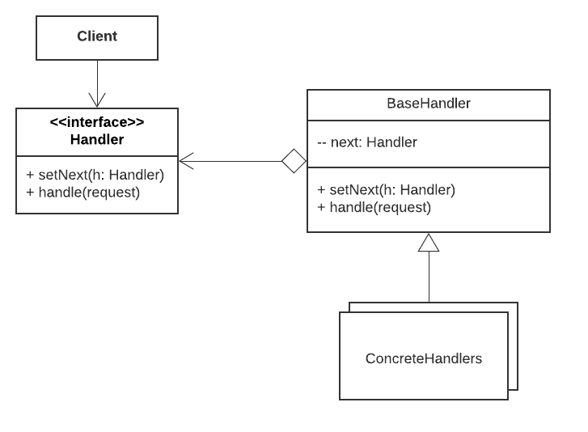

### Pontos positivos

- É possível controlar a ordem de tratamento dos objetos.
- *Princípio de responsabilidade única*. Você pode realizar a manutenção do código sem afetar os outros componentes diretamente.
- *Princípio aberto/fechado*. Você pode adicionar novos componentes ao código sem quebrar ou afetar os outros componentes já existentes.

### Pontos negativos

- Alguns objetos podem acabar sem tratamento.

### Aplicação

Dentro do nosso projeto, não foi feito muitas dependências sobre responsabilidade de um objeto sobre o outro, logo não foi utilizado o padrão **Chain Of Responsability**.

## Command

É um padrão no qual os objetos são usados ​​para encapsular todas as informações necessárias para realizar ações ou disparar eventos no futuro.

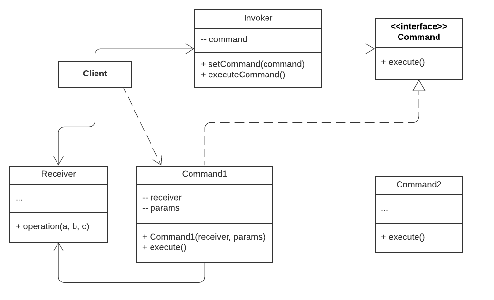

### Pontos positivos

- *Princípio de responsabilidade única*. Você pode realizar a manutenção do código sem afetar os outros componentes diretamente.
- *Princípio aberto/fechado*. Você pode adicionar novos componentes ao código sem quebrar ou afetar os outros componentes já existentes.
- É possível implementar execuções adiadas de operações.
- É possível combinar um conjunto de comandos simples em um complexo.

### Pontos negativos

- Uma vez que uma nova camada é introduzida entre o emissor e o receptor, o código pode se tornar mais complicado.

### Aplicação

Não foi aplicado esse padrão de projeto dentro do projeto, pela falta de escopo do projeto para podermos realizar a aplicação.

## Iterator

Iterator é um padrão de design comportamental que permite percorrer os elementos de uma coleção sem expor sua representação (lista, pilha, árvore, etc.).

### Pontos positivos

- *Princípio de responsabilidade única*. Você pode realizar a manutenção do código sem afetar os outros componentes diretamente.
- *Princípio aberto/fechado*. Você pode adicionar novos componentes ao código sem quebrar ou afetar os outros componentes já existentes.
- Como cada objeto iterador contém seu próprio estado de iteração, a mesma coleção pode ser iterada em paralelo.
- É possível atrasar uma iteração e continuá-la quando necessário.

### Pontos negativos

- Aplicar o padrão pode ser um preciosismo se sua aplicação só trabalha com coleções simples.
- Usar um iterador pode ser menos eficiente que percorrer elementos de algumas coleções especializadas diretamente.

### Aplicação

Foi durante a composição das telas de `Pesquisas`, `Minhas Receitas` e `Cadastro de Receitas`. Foram utilizados o padrão **Iterator**, sendo assim, o código passa por todo o Array de objetos referentes às receitas culinárias fazendo com que sejam todos exibidos dentro da tela. Porém com apenas uma única instanciação do objeto.

**Pesquisa de Receitas**

São utilizados a iterator através de uma diretriz do Angular, o "ngFor" que realiza a iteração sobre os elementos de um vetor.

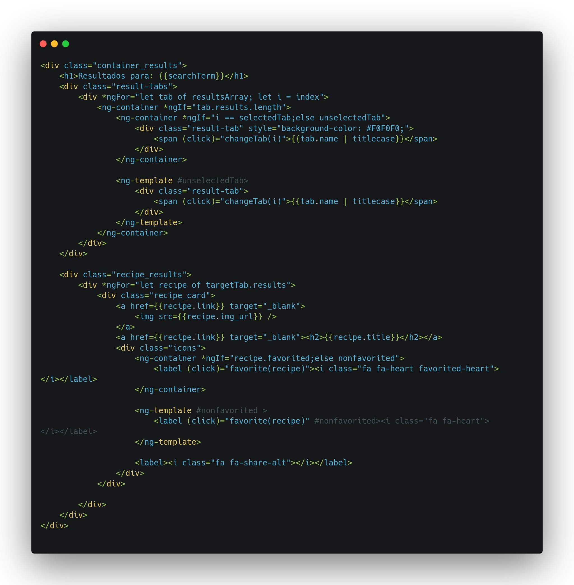

[pesquisa-iterator.component.html](https://github.com/UnBArqDsw/2020.1_G3_RecipeBuk_Frontend/blob/dev/src/app/pesquisa/pesquisa.component.html)

**Minhas Receitas**

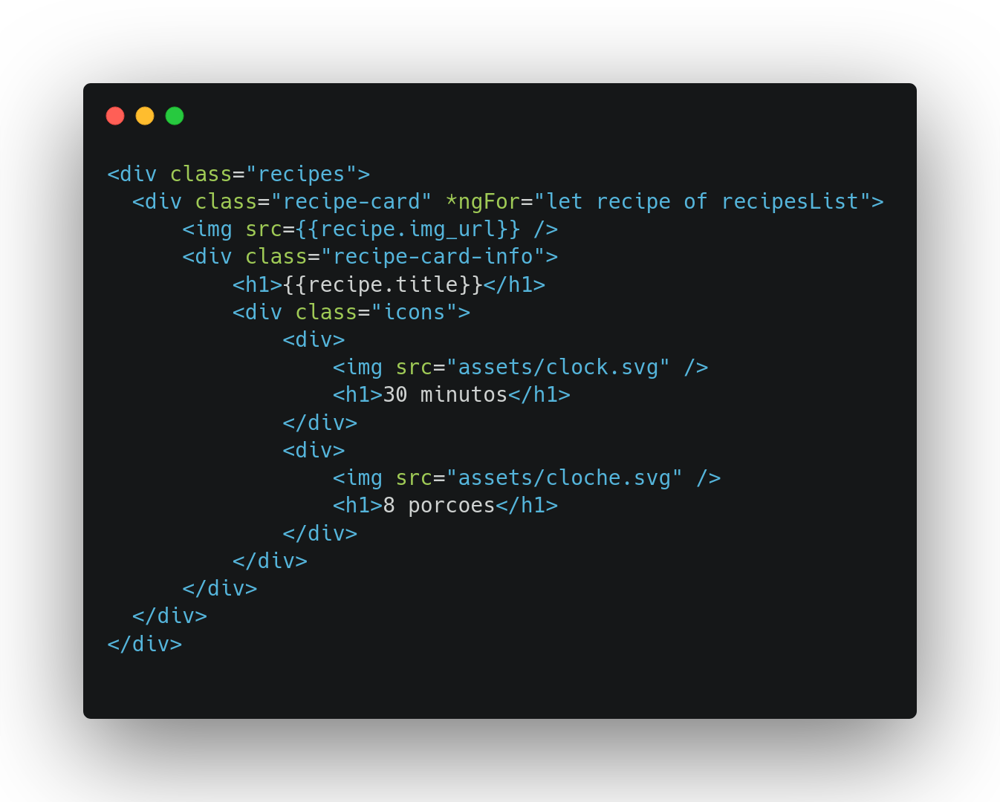

[minha-receita.component.html](https://github.com/UnBArqDsw/2020.1_G3_RecipeBuk_Frontend/blob/dev/src/app/minhas-receitas/minhas-receitas.component.html)

**Cadastro de Receitas**

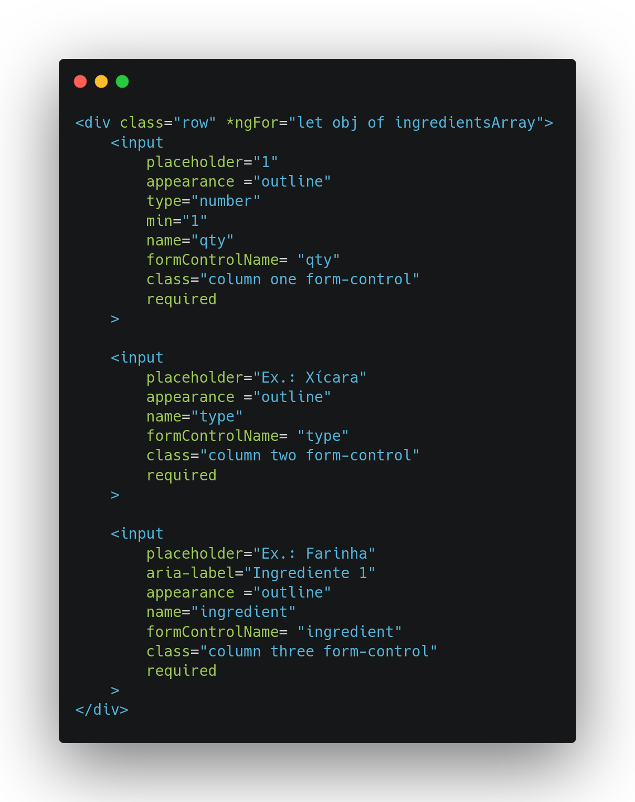

[cadatro-receitas.component.html](https://github.com/UnBArqDsw/2020.1_G3_RecipeBuk_Frontend/blob/dev/src/app/cadastro-receitas/cadastro-receitas.component.html)

## Mediator

Este é um padrão de projeto frequentemente utilizado quando é necessário encapsular como os objetos interagem, ou seja, estabelecer comunicação entre os objetos por meio de um mediador.

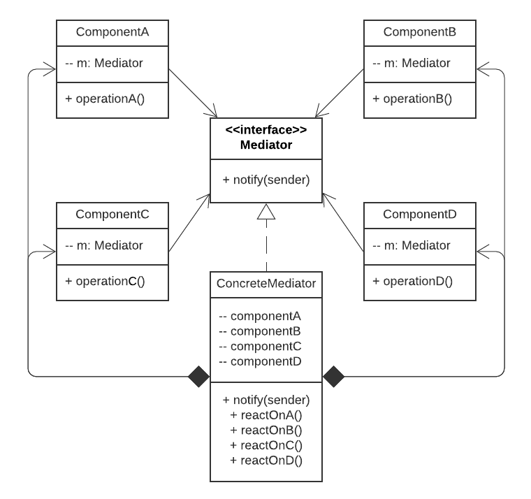

### Pontos positivos

- *Princípio de responsabilidade única*. Você pode realizar a manutenção do código sem afetar os outros componentes diretamente.
- *Princípio aberto/fechado*. Você pode adicionar novos componentes ao código sem quebrar ou afetar os outros componentes já existentes.
- É possível reduzir o acoplamento entre os vários componentes de um programa.
- É possível reutilizar componentes individuais mais facilmente.

### Pontos negativos

- É possível que o mediator vire um God Object.

### Aplicação

No frontend, cada tela conta com uma implementação de um `Mediator` que trata de pegar dados dos Serviços, que também são formas de implementação do Mediator e colocá-los nas telas. Nisso, não é feito o acesso direto do usuário ao banco de dados, sendo assim todos os dados passam pelo Mediator que trata os dados e exibe de forma segura e confiável.

**Serviço de usuário**

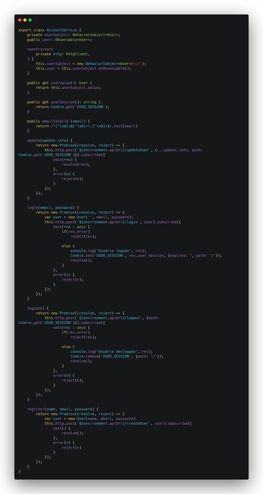

[account.service.ts](https://github.com/UnBArqDsw/2020.1_G3_RecipeBuk_Frontend/blob/dev/src/app/services/account.service.ts)

**Serviço de receitas**

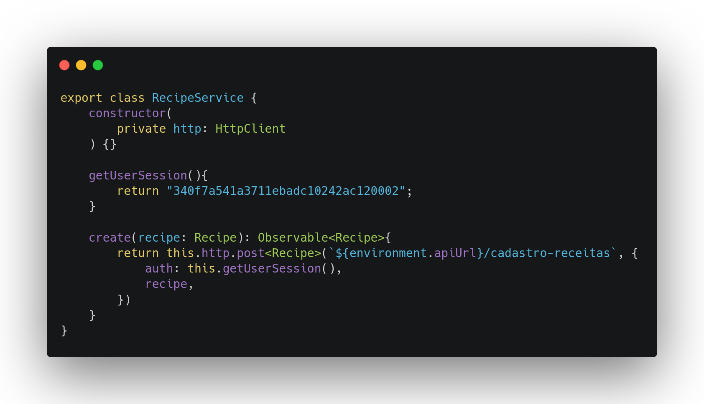

[recipe.service.ts](https://github.com/UnBArqDsw/2020.1_G3_RecipeBuk_Frontend/blob/dev/src/app/services/recipe.service.ts)

**Serviço de Buscador**

[search.service.ts](https://github.com/UnBArqDsw/2020.1_G3_RecipeBuk_Frontend/blob/dev/src/app/services/search.service.ts)

## Memento

É um padrão de projeto que permite armazenar o estado interno de um objeto em um determinando momento, para que seja possível retorná-lo a este estado, sem que isso cause problemas com o encapsulamento.

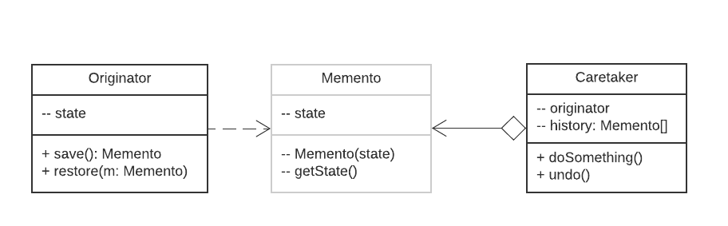

### Pontos positivos

- O retrato do estado do objeto pode ser gerado sem violar seu encapsulamento.
- Ao permitir que o cuidador mantenha um registro histórico da identidade do originador, dessa forma o código do originador pode ser simplificado.

### Pontos negativos

- A aplicação pode consumir muita RAM se os clientes criarem mementos com muita frequência.
- Cuidadoras devem acompanhar o ciclo de vida da originadora para serem capazes de destruir mementos obsoletos.
- A maioria das linguagens de programação dinâmicas, tais como PHP, Python, e JavaScript, não conseguem garantir que o estado dentro do memento permaneça intacto.

### Aplicação

Esse padrão de projeto foi aplicado também no frontend do projeto, durante o armazenamento da "Sessão do Usuário", esse estado mostra para o sistema que o usuário está logado, portanto tem acesso às funcionalidades de usuário, como criar receitas, acessar suas próprias receitas, etc. A sessão de usuário é salva internamente no sistema, e resgatada em diversas telas para validação de tão condição.

**Sessão de usuário no Account Service**

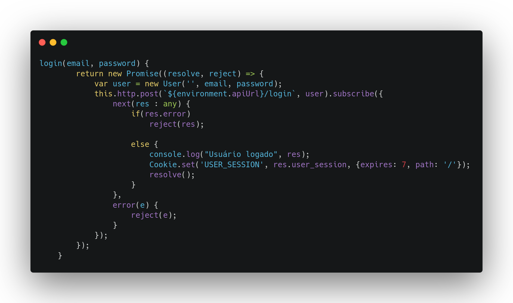

[account.service.ts](https://github.com/UnBArqDsw/2020.1_G3_RecipeBuk_Frontend/blob/dev/src/app/services/account.service.ts)

**Construtor NavBar - User Session**

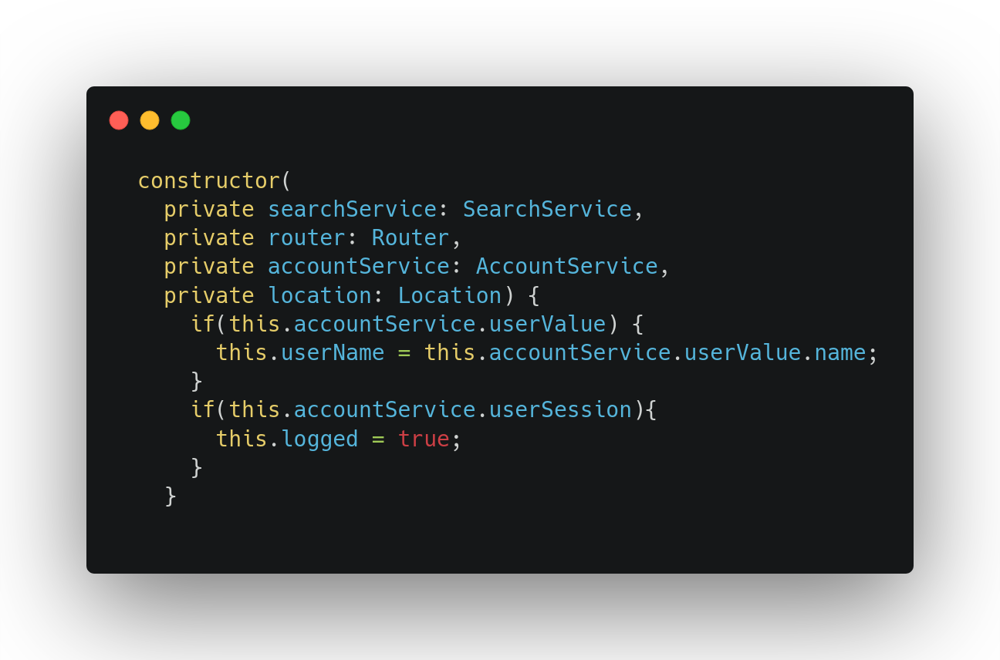

[navbar.component.ts](https://github.com/UnBArqDsw/2020.1_G3_RecipeBuk_Frontend/blob/dev/src/app/navbar/navbar.component.ts)

## Observer

 É um padrão de projeto de software que define uma dependência um-para-muitos entre objetos de modo que quando um objeto muda o estado, todos seus dependentes são notificados e atualizados automaticamente.

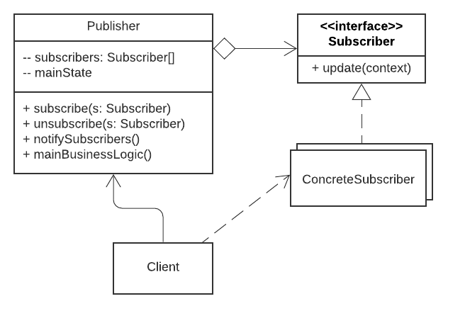

### Pontos positivos

- *Princípio aberto/fechado*. Você pode adicionar novos componentes ao código sem quebrar ou afetar os outros componentes já existentes.
- É possível estabelecer relações entre objetos durante a execução.

### Pontos negativos

- Dependentes são notificados em ordem aleatória

### Aplicação

Foi aplicado o padrão **Observer** para a visualização e espera de dados para pesquisa. Atualizando os resultados da pesquisa de acordo com as requisições do usuário.

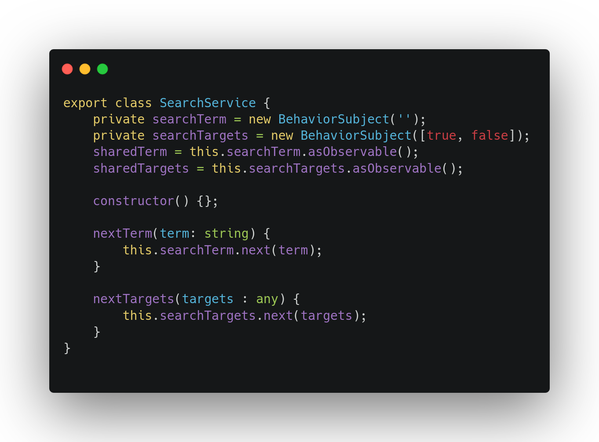

[search.service.ts](https://github.com/UnBArqDsw/2020.1_G3_RecipeBuk_Frontend/blob/dev/src/app/services/search.service.ts)

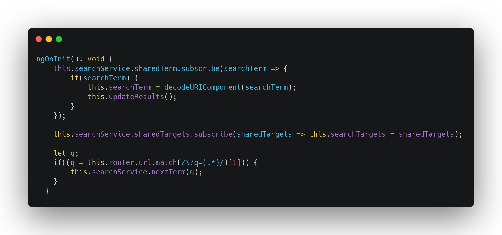

[pesquisa.component.ts](https://github.com/UnBArqDsw/2020.1_G3_RecipeBuk_Frontend/blob/dev/src/app/pesquisa/pesquisa.component.ts)

## State

O padrão State permite que um objeto altere seu comportamento quando seu estado interno muda.

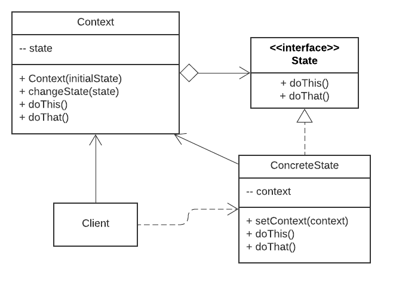

### Pontos positivos

- *Princípio de responsabilidade única*. Você pode realizar a manutenção do código sem afetar os outros componentes diretamente.
- *Princípio aberto/fechado*. Você pode adicionar novos componentes ao código sem quebrar ou afetar os outros componentes já existentes.
- É possível simplificar o código de contexto ao eliminar condicionais de máquinas de estado pesadas.

### Pontos negativos

- Aplicar o padrão pode ser um gasto execessivo se a máquina de estado só tem alguns estados ou raramente muda eles.

### Aplicação

Não foi aplicado o State devido à falta de implementação de objetos e estados pré-definidos para o projeto, visto que o mesmo não se trata de uma software tão complexo.

## Strategy

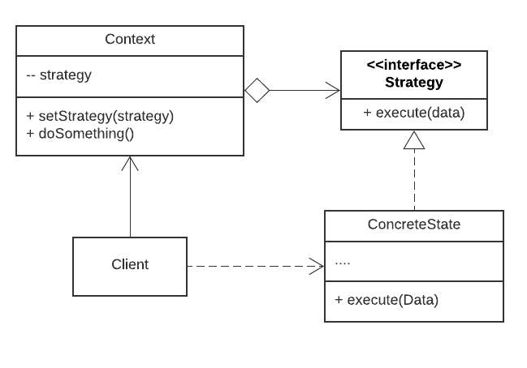

É um padrão de projeto comportamental que permite que você defina uma família de algoritmos, coloque-os em classes separadas, e faça os objetos deles intercambiáveis.

### Pontos positivos

- *Princípio aberto/fechado*. Você pode adicionar novos componentes ao código sem quebrar ou afetar os outros componentes já existentes.
- É possível trocar algoritmos usados dentro de um objeto durante a execução.
- É possível isolar os detalhes de implementação de um algoritmo do código que usa ele.
- É possível substituir a herança por composição.

### Pontos negativos

- Se há, apenas, um par de algoritmos e eles raramente mudam, não há motivo real para deixar o programa mais complicado com novas classes e interfaces.

### Aplicação

Não foi aplicado no projeto, pelo tamanho do escopo do software.

## Template Method

É um padrão de projeto comportamental que define o esqueleto de um algoritmo na superclasse mas deixa as subclasses sobrescreverem etapas específicas do algoritmo sem modificar sua estrutura.

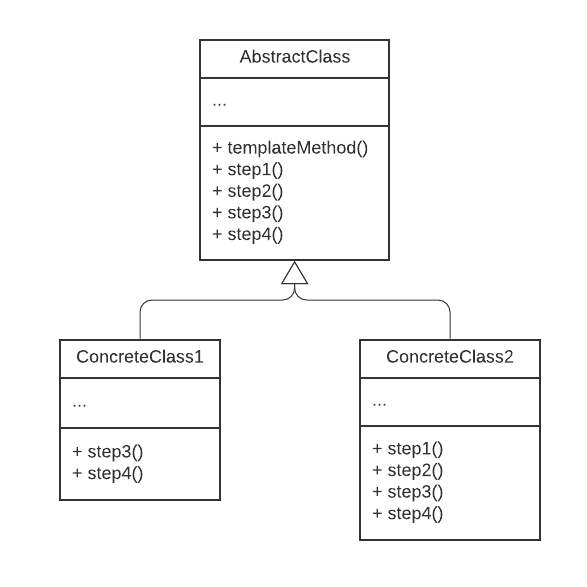

### Pontos positivos

- É possível evoluir o código duplicado para uma superclasse.
- É possível sobrescrever apenas certas partes de um algoritmo grande, tornando-os menos afetados por mudanças que acontece por outras partes do algoritmo.

### Pontos negativos

- Alguns clientes podem ser limitados ao fornecer o esqueleto de um algoritmo.
- É possível violar o princípio de substituição de Liskov ao suprimir uma etapa padrão de implementação através da subclasse.
- Nível da dificuldade de implementação.

### Aplicação

Não foi aplicado no projeto, devido à implementações e padrões anteriormente implementados. Fazendo com que seja inviável a utilização deste padrão dentro do projeto.

## Visitor

Este é um padrão de design comportamental que permite separar algoritmos dos objetos nos quais operam.

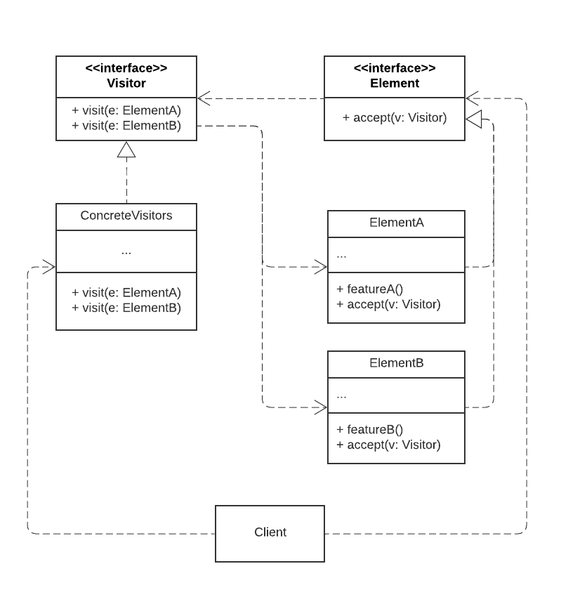

### Pontos positivos

- *Princípio de responsabilidade única*. Você pode realizar a manutenção do código sem afetar os outros componentes diretamente.
- *Princípio aberto/fechado*. Você pode adicionar novos componentes ao código sem quebrar ou afetar os outros componentes já existentes.
- Um objeto visitante pode acumular algumas informações úteis enquanto trabalha com vários objetos. Isso pode ser interessante para percorrer um objeto de estrutura complexa, tais como um objeto árvore, e aplicar o visitante para cada objeto da estrutura.

### Pontos negativos

- É necessário atualizar todos os visitantes a cada vez que a classe é adicionada ou removida da hierarquia de elementos.
- Objetos visitantes podem não ter seu acesso permitido para campos e métodos privados dos elementos que eles deveriam estar trabalhando.

### Aplicação

Padrão não aplicado, devido a falta de implementação de software no qual o padrão se encaixe.

## Referências Bibliográficas

[1] REFACTORING.GURU. Padrões de Projeto. Disponível em: <<https://refactoring.guru/pt-br/design-patterns>>. Acesso em: 14 nov. 2020.
