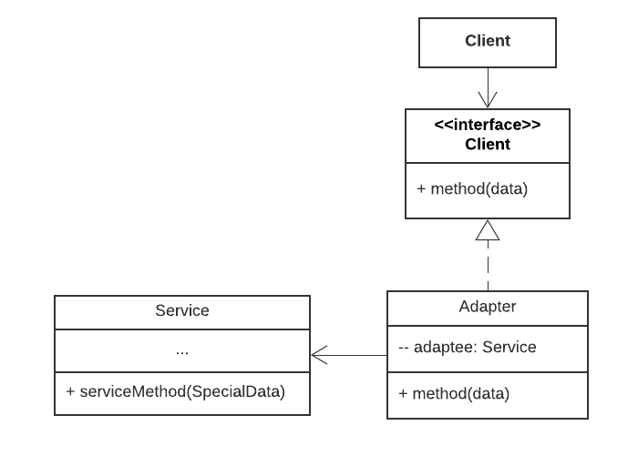
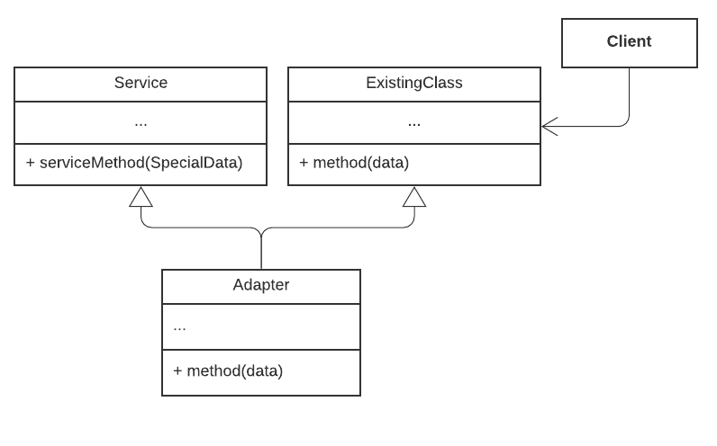
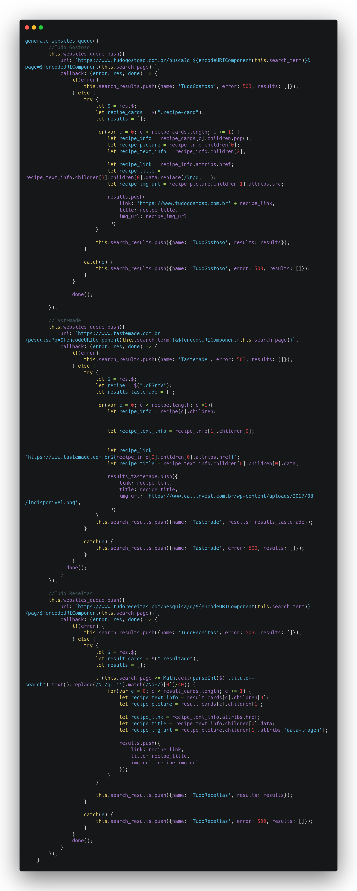
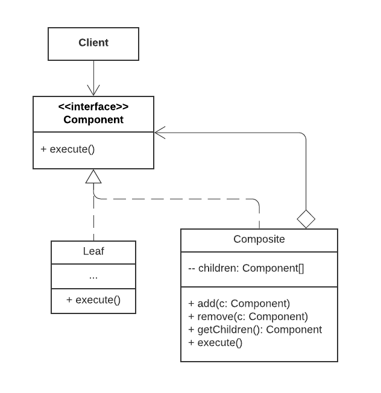
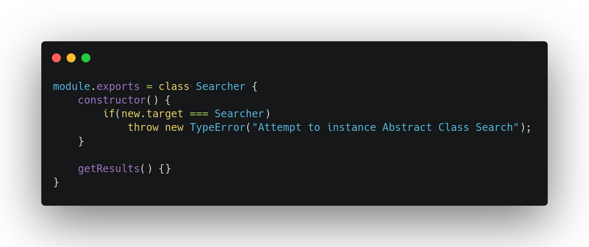
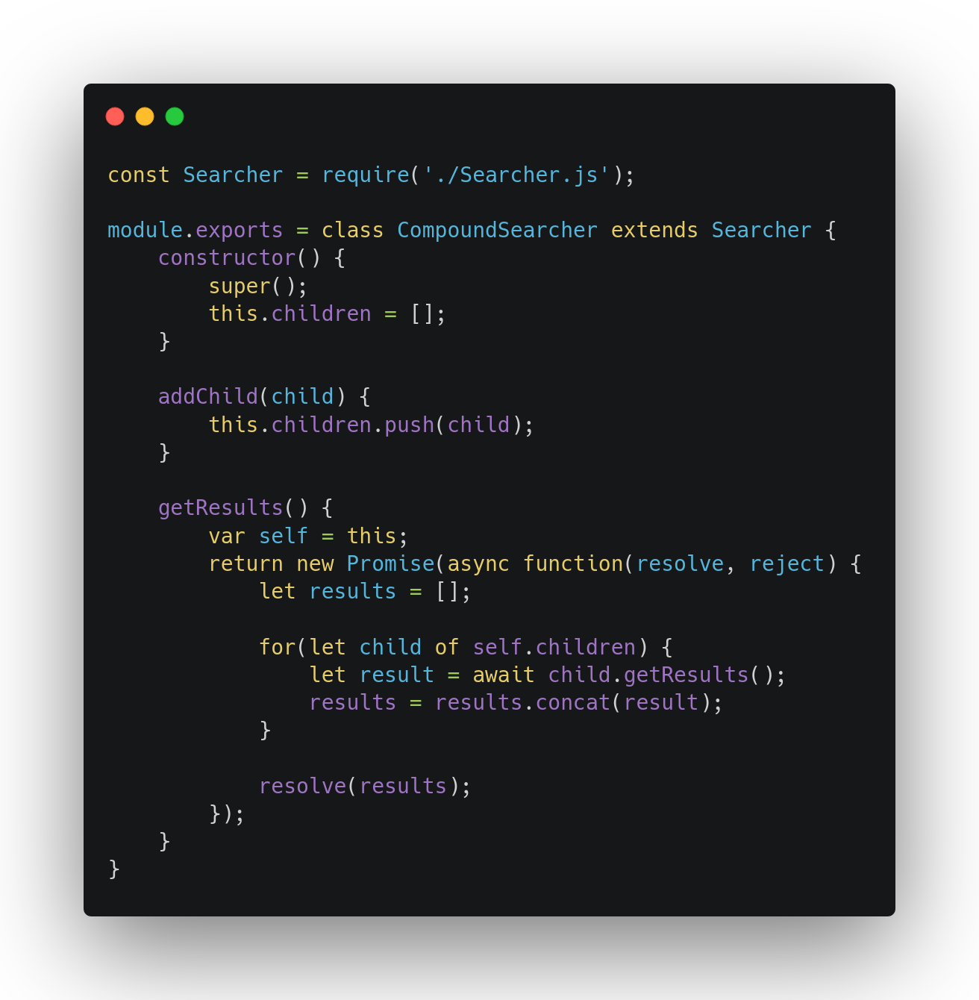
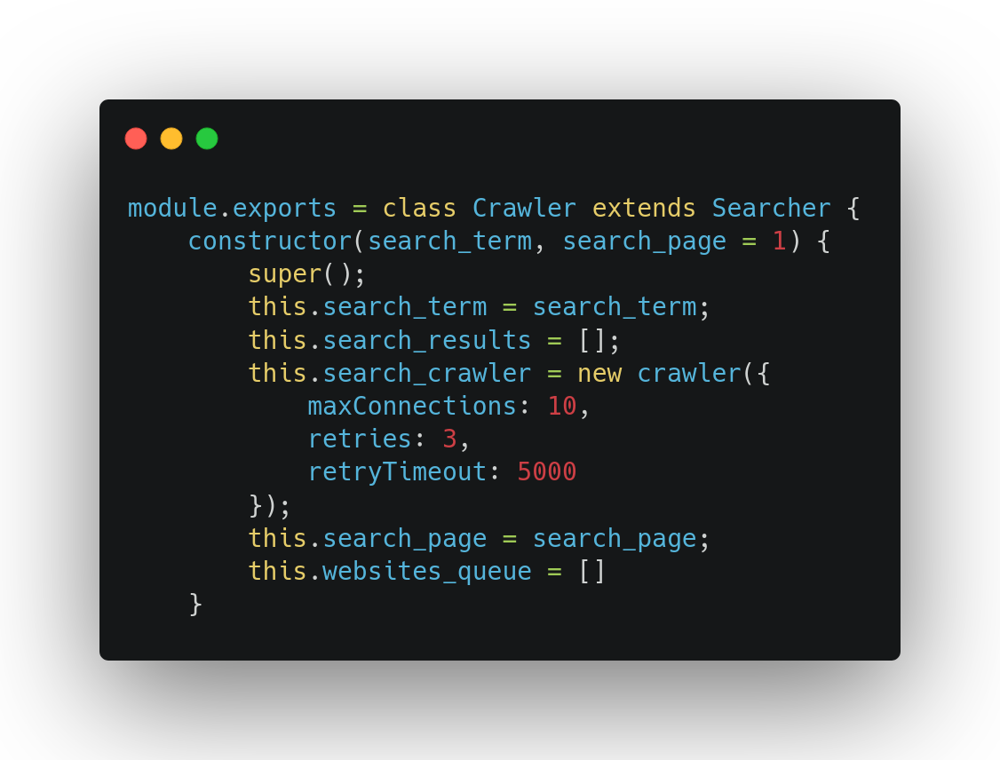
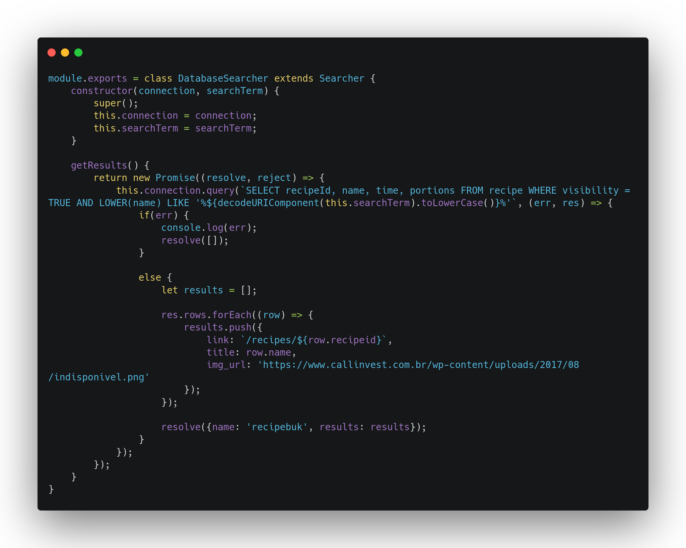
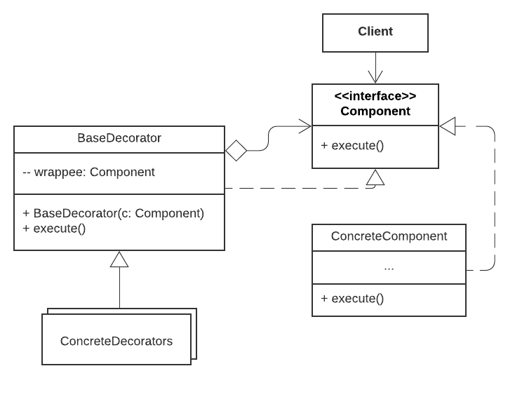

| Data |Versão| Autor | Descrição |
| ---- | ---- | ----- | --------- |
| 2020/10/24 | 0.1 | Samuel | Implementação do GOF - Estrutural (Composite)|
| 2020/11/14 | 1.0 | Dâmaso e Letícia | Criação do Documento |

# Estudo Dirigido - GoFs Estrutural

## Adapter

O **Adapter** permite que objetos com interfaces incompatíveis possam trabalhar conjunto.

Geralmente esse tipo de padrão de projeto é utilizado quando é necessário acessar alguma biblioteca útil ou legado que seja necessária a utilização no projeto, porém essa biblioteca é incompatível com os tipos de dados que são apresentados dentro do software.

1. É criado uma classe de interface para o  `Client` que descreve o que é necessário para outras classes funcionarem com o meu código já existente.
2. É criado uma classe `Adapter` para que essa possa fazer a conexão com o serviço ou biblioteca a qual eu necessito utilizar para alterar as estruturas dos meus dados dentro do projeto.
3. Por fim, a biblioteca ou serviço externo é conectado ao meu `Adapter` para que ela possa se comunicar com o resto do meu software.

Existem dois tipos de Adapters:

**Adaptador de Objeto**

**Adaptador de Classe**

### Pontos positivos

- *Princípio de responsabilidade única*. Você pode realizar a manutenção do código sem afetar os outros adaptadores diretamente.
- *Princípio aberto/fechado*. Você pode adicionar novos adaptadores ao código sem quebrar ou afetar os clientes ou adaptadores já existentes.

### Pontos negativos

- A complexidade do código aumenta bastante pela quantidade de interfaces e classes que tendem a ser criadas para plena adaptação de todos os problemas, sendo mais simples a implementação de mudanças dentro das classes ou serviços. Mantendo um pouco da qualidade do software.

### Aplicação

Foi utilizado no backend do projeto, a biblioteca `Crawler` que é reponsável por buscar receitas em sites de terceiros como se fosse um web-crawler mesmo que faz a varredura em outros sites e busca por conteúdos pré-definidos. 
A forma da implementação aconteceu dentro da classe, onde precisavámos adaptar o dado recebido pela biblioteca para o dado que nós iríamos mostrar ao usuário.

[Crawler.js](https://github.com/UnBArqDsw/2020.1_G3_RecipeBuk_Backend/blob/dev/src/models/Crawler.js)

## Bridge

O **Bridge** é um padrão que arquitetura que divide o desenvolvimento de uma grande classe em duas hierarquias, abstração e implementação fazendo com que elas funcionem uma independente da outra.

Exemplo: Suponhamos que em um restaurante seja servido comida italiana e japonesa e são utilizamos pratos redondos e quadrados. Caso fossemos implementar classes concretas para cada prato do restaurante, teríamos 4 opções, Italiana em Prato Quadrado, Japonesa em Prato Redondo... e assim por diante. Caso queira adicionar um novo tipo de comida, vai ser necessário mais algumas classes para adequar tudo que é necessário e essa adição acontece exponencialmente. Com o **Bridge** temos podemos dividir esse problema em duas classes de Abstração e Implementação. No caso a abstração seria o Prato, e a implementação seria a Comida. Caso queira agora adicionar novos elementos é necessário apenas adicionar novas hierarquias dentro das duas classes de Prato e Comida.

1. É criado uma classe de Abstração que define a lógica de controle de alto nível
2. É criado uma classe de Implementação que define quais vão ser as implementações que pertencem à classe de Abstração.
3. É criado então subclasses referentes à implementação e abstração, fazendo com que o código se divida de forma coesa.

### Pontos positivos

- È possível criar interfaces e plataformas independentes dos sistemas operacionais
- O código não fica exposto à detalhes de implementação pois ele fica exposto apenas à abstrações de alto nível.
- *Princípio de responsabilidade única*. Você pode realizar a manutenção do código sem afetar os outros adaptadores diretamente.
- *Princípio aberto/fechado*. Você pode adicionar novos adaptadores ao código sem quebrar ou afetar os clientes ou adaptadores já existentes.

### Pontos negativos

- Ao aplicar o padrão de uma classe altamente coesa, o código tende a ficar cada vez mais complexo.

### Aplicação

Esse padrão não foi aplicado ao projeto por falta de escopo para aplicação de tal padrão. Sendo algo que pode ser muito escalável e que não se aplica ao nosso projeto.

## Composite

O **Composite** é um padrão de projeto que estrutura objetos em formato de composição de um objeto principal. Como se fosse árvore, o objeto principal, e os galhos os objetos em formato de composição.

Exemplo: Imagine que o Google tem um buscador apenas para os Estados Unidos, e ele quer organizar a estrutura de um projeto para adicionar novos países dentro do buscador dele de forma que cada país tenha o seu buscador. Isso pode ser feito através do **Composite** que define a estrutura do projeto de forma que seja possível adicionar mais componentes desse projeto maior. Imagine agora que cada estado de determinado país tenha um buscador específico para ele. Sendo assim, além do **Composite** para montar e adicionar novos países. Seria necessário a implementação de mais um **Composite** que adicionaria estados à classe País.

1. É declarado uma interface componente que é uma classe que trata de instanciar e tratar de fazer a chamada dos componentes para que eles executem suas funções.
2. É chamado então a classe `Leaf` que é o componente concreto que implementa de fato a função a ser executada.
3. É implementado o `Composite` que é a classe responsável por tratar todo o relacionamento e ordem de execução dos componentes filhos sobre a interface. Essa classe se comunica apenas com a interface, não tendo acesso direto aos componentes. Ela também pode adicionar novos componentes à classe asbtrata.

### Pontos positivos

- É possível trabalhar com estruturas mais complexas de forma conveniente, utilizando a recursividade e polimorfismo ao seu favor.
- *Princípio aberto/fechado*. Você pode adicionar novos componentes ao código sem quebrar ou afetar os componentes já existentes.

### Pontos negativos

- Pode ser complexa a implementação de classes que diferem muito o seu propósito. Fazendo com que seja necessário a implementação não trivial de certas funcionalidades. Fazendo com que seja difícil a compreensão do código.

### Aplicação

Dentro do nosso projeto, tivemos a implementação desse padrão dentro da classe `Searcher` que é o responsável de organizar todos os componentes e diferentes tipos de buscadores, o web-crawler e o buscador comum do site que faz buscas no nosso próprio banco de dados.

Logo, a divisão foi feita da seguinte forma.

A Classe `super` foi definida como `Seacher`.

[Searcher.js](https://github.com/UnBArqDsw/2020.1_G3_RecipeBuk_Backend/blob/dev/src/models/Searcher.js)

Ela conta com um `CompoundSearcher`, que permite a adição e deleção de novos membros à classe principal.

[CompoundSearcher.js](https://github.com/UnBArqDsw/2020.1_G3_RecipeBuk_Backend/blob/dev/src/models/CompoundSearcher.js)

Foram adicionados também, dois membros para compor, por fim, esse conjunto de classes.

O `Crawler` que realiza pesquisas em outros websites fora do nosso domínio.

[Crawler.js](https://github.com/UnBArqDsw/2020.1_G3_RecipeBuk_Backend/blob/dev/src/models/CompoundSearcher.js)

O `Database Searcher` que realiza pesquisas dentro do banco de dados do RecipeBük.

[DatabaseSeacher.js](https://github.com/UnBArqDsw/2020.1_G3_RecipeBuk_Backend/blob/dev/src/models/DatabaseSearcher.js)

Com isso, foi atualizado o diagrama de classes para a nova realidade: [Diagrama de Classe v2](../../04-modelagem/diagrama-classes.md)

## Decorator

O **Decorator** é um padrão de projeto que tem como objetivo estender o comportamento ou minar comportamentos existentes à partir de um "Decorador" base. 

Exemplo: Vamos supor que você tenha um sistema de notificações em que você possa enviar notificações para o Email, SMS, Faceobok e Slack. Para implementar todos os tipos de envios de notificações iríamos ter que declarar métodos que façam isso em suas respectivas classes. Porém, se eu quiser enviar notificações para mais de um meio ao mesmo tempo, sendo a mesma notificação. Para isso que temos o padrão de projeto **Decorator**, nele é possível fazer a implementação de um DecoratorBase que faz com que todos os outros métodos sejam chamados concorrentemente, fazendo com que a execução do software seja mais eficaz e fluída.

1. É criado uma classe pai para implementação principal do método, por exemplo, `send(notifier)`.
2. O `BaseDecorator` é criado para poder servir como base para a criação de outras classes que irão herdar do BaseDecorator no momento de suas implementações.
3. É criado então diversas classes que herdam de `BaseDecorator` métodos principais para a execução do `send(notifier)`.

### Pontos positivos

- É possível mudar o comportamento de um objeto sem estender ele à uma subclasse.
- É possível alterar o comportamento do objeto durante a sua execução, adicionando ou removendo responsabilidades.
- É possível combinar diversos complementos utilizando vários decoradores em um mesmo objeto.
- *Princípio de responsabilidade única*. Você pode realizar a manutenção do código sem afetar os outros decoradores diretamente.

### Pontos negativos

- É dificil remover um invólucro de uma pilha de invólucros.
- É dificil implementar um decorador que não dependa do comportamento da ordem da pilha.
- A configuração inicial do código de camadas pode ficar muito feia.

### Aplicação

Não foi aplicado nenhum padrão `Decorator` em nosso projeto, pela falta de elementos que concorrem entre si sobre a execução de atividades parecidas. Sendo assim um padrão que ficasse fora do escopo do projeto como um todo.

## Referências