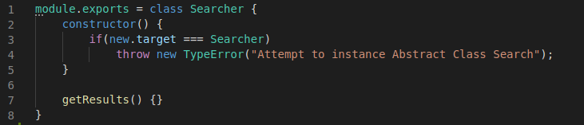
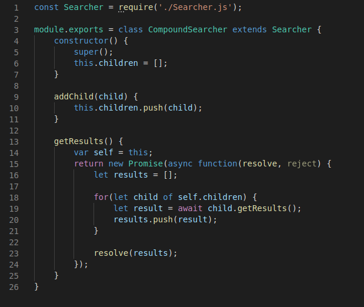
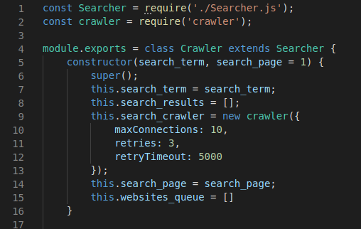
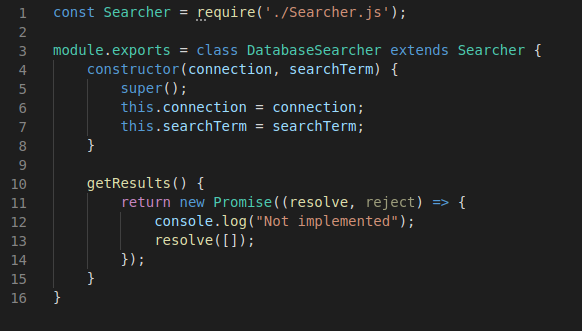

| Data |Versão| Autor | Descrição |
| ---- | ---- | ----- | --------- |
| 2020/10/24 | 0.1 | Samuel | Implementação do GOF - Estrutural 
| 2020/10/24 | 0.2 | Dâmaso | Criação do documento para a Wiki |

# GOFs - Estruturais

## Composite

Esse padrão de projeto define um modelo de implementação de código. No qual, existe uma classe `super` de outras classes que estão dispostas em formatos de modulos.

A Classe `super` foi definida como `Seacher`.

[Searcher.js](https://github.com/UnBArqDsw/2020.1_G3_RecipeBuk_Backend/blob/dev/src/models/Searcher.js)

Ela conta com um `CompoundSearcher`, que permite a adição e deleção de novos membros à classe principal.

[CompoundSearcher.js](https://github.com/UnBArqDsw/2020.1_G3_RecipeBuk_Backend/blob/dev/src/models/CompoundSearcher.js)

Foram adicionados também, dois membros para compor, por fim, esse conjunto de classes.

O `Crawler` que realiza pesquisas em outros websites fora do nosso domínio.

[Crawler.js](https://github.com/UnBArqDsw/2020.1_G3_RecipeBuk_Backend/blob/dev/src/models/CompoundSearcher.js)

O `Database Searcher` que realiza pesquisas dentro do banco de dados do RecipeBük.

[DatabaseSeacher.js](https://github.com/UnBArqDsw/2020.1_G3_RecipeBuk_Backend/blob/dev/src/models/DatabaseSearcher.js)

Com isso, foi atualizado o diagrama de classes para a nova realidade: [Diagrama de Classe v2](../../04-modelagem/diagrama-classes.md)