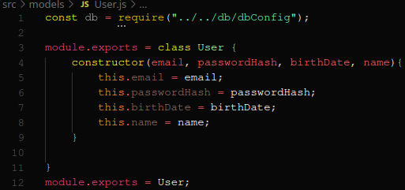
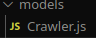
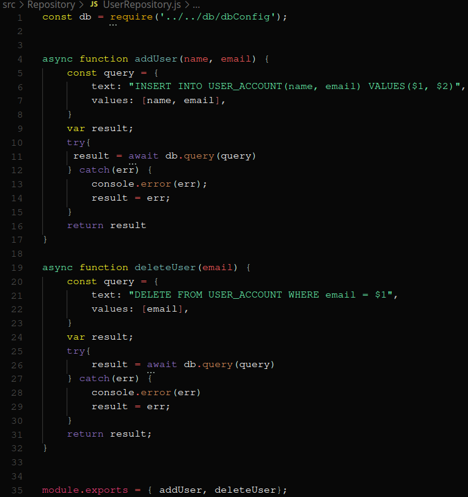
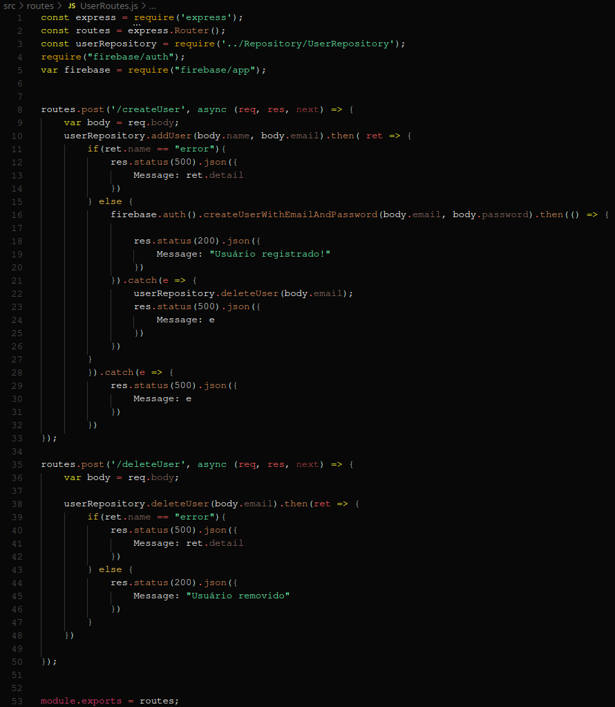
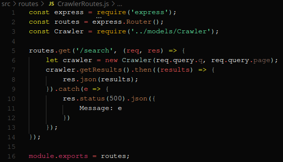

| Data |Versão| Autor | Descrição |
| ---- | ---- | ----- | --------- |
| 2020/10/23 | 1 | Luís Henrique e Eduardo Lima | Criação do Documento |
| 2020/10/26 | 1.1 | Eduardo Lima | Adição de links |

# GRASPs Backend

## GRASP Criador

* User

Apesar de ser um Criador, também é o Especialista responsável por instanciar um usuário na aplicação.

[User.js](https://github.com/UnBArqDsw/2020.1_G3_RecipeBuk_Backend/blob/dev/src/models/User.js)

* Crawler

Criador responsável pela criação do crawler.

[Crawler.js](https://github.com/UnBArqDsw/2020.1_G3_RecipeBuk_Backend/blob/dev/src/models/Crawler.js)

## GRASP Especialista

* UserRepository

Especialista responsável por toda interação da model User com o banco de dados.

[UserRepository.js](https://github.com/UnBArqDsw/2020.1_G3_RecipeBuk_Backend/blob/dev/src/Repository/UserRepository.js)

* UserRoutes

Especialista responsável por toda interação da model User com sistemas externos ao backend da aplicação.

[UserRoutes.js](https://github.com/UnBArqDsw/2020.1_G3_RecipeBuk_Backend/blob/dev/src/routes/UserRoutes.js)

* SearchRoutes

Especialista responsável por toda interação da model Crawler com sistemas externos ao backend da aplicação.

[SearchRoutes.js](https://github.com/UnBArqDsw/2020.1_G3_RecipeBuk_Backend/blob/dev/src/routes/SearchRoutes.js)
