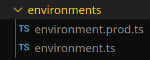
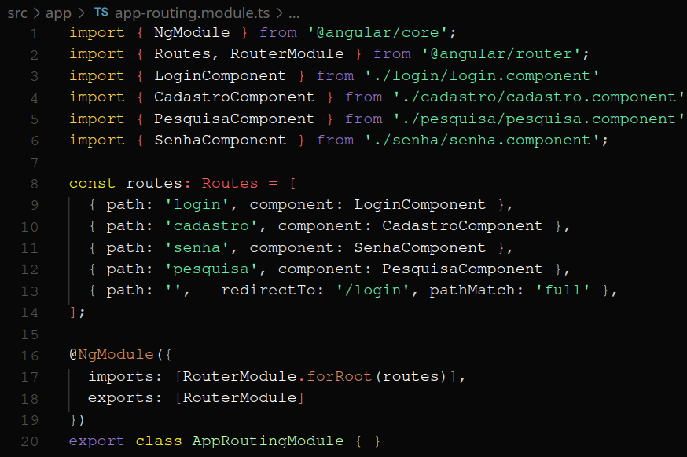
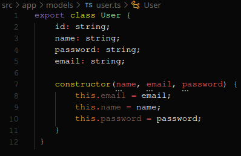
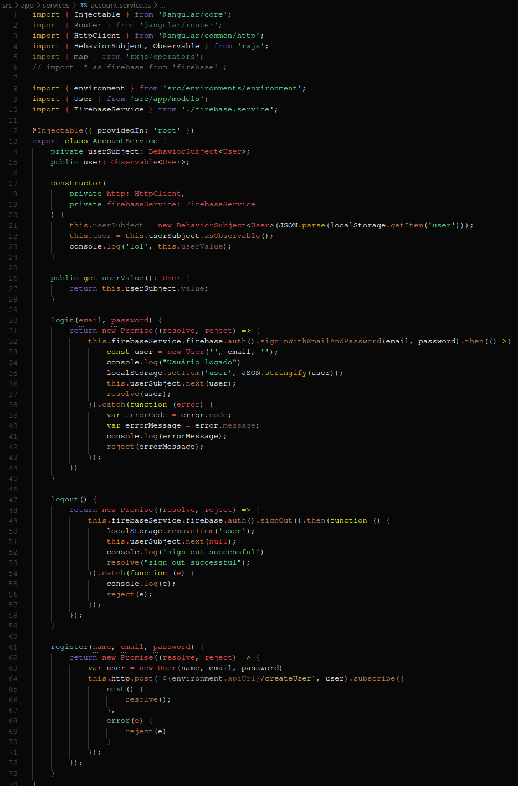

| Data |Versão| Autor | Descrição |
| ---- | ---- | ----- | --------- |
| 2020/10/23 | 1 | Luís Henrique e Eduardo Lima | Criação do Documento |
| 2020/10/26 | 1.1 | Eduardo Lima | Adição de links |

# GRASPs Frontend

## GRASP Criador

* Criador environment.ts

Criador responsável por instanciar variáveis de ambiente.

* Criador app-routing.module.ts

Responsável por instanciar as rotas da aplicação.

[app-routing.module.ts](https://github.com/UnBArqDsw/2020.1_G3_RecipeBuk_Frontend/blob/dev/src/app/app-routing.module.ts)

* Criador user.ts

Classe responsável por instaciar o usuário.

[user.ts](https://github.com/UnBArqDsw/2020.1_G3_RecipeBuk_Frontend/blob/dev/src/app/models/user.ts)

## GRASP Especialista

* Especialista firebase-service.ts

Especialista responsável pela interação da aplicação com o serviço externo firebase.

[firebase.service.ts](https://github.com/UnBArqDsw/2020.1_G3_RecipeBuk_Frontend/blob/dev/src/app/services/firebase.service.ts)

* Especialista account.service.ts

Responsável pelas operações que dizem respeito ao usuário.

[account.service.ts](https://github.com/UnBArqDsw/2020.1_G3_RecipeBuk_Frontend/blob/dev/src/app/services/account.service.ts)
