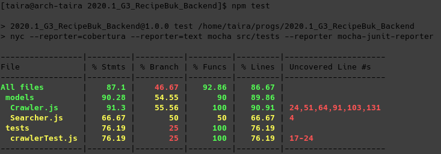
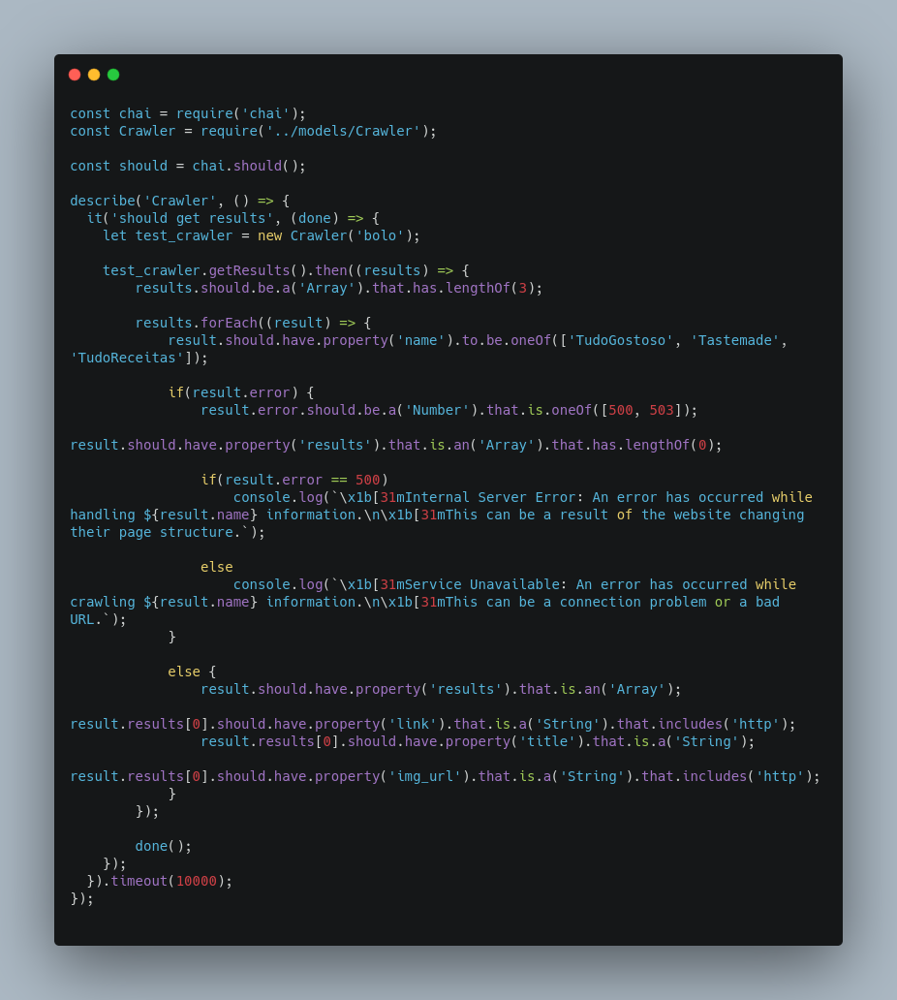
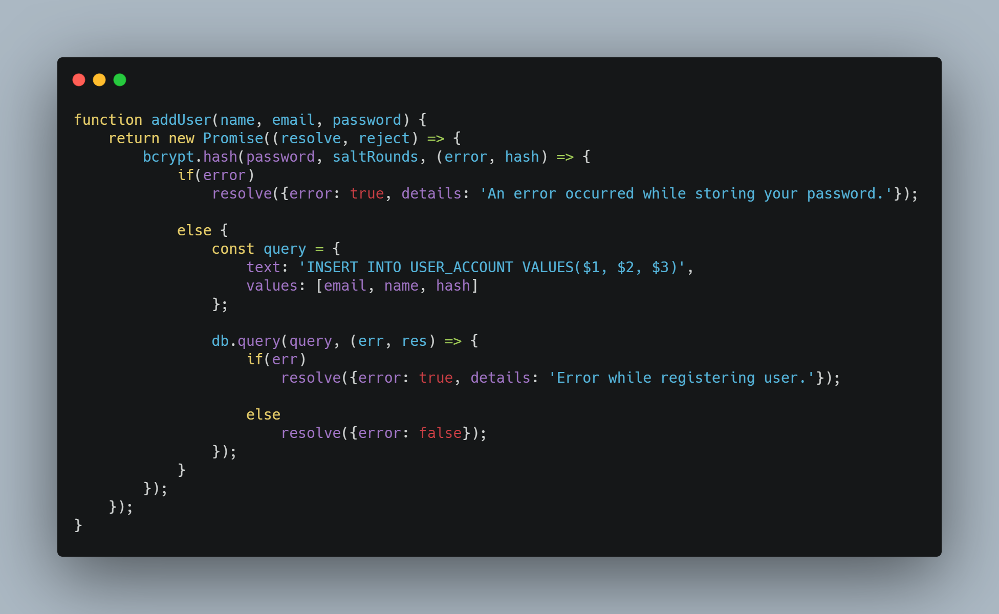
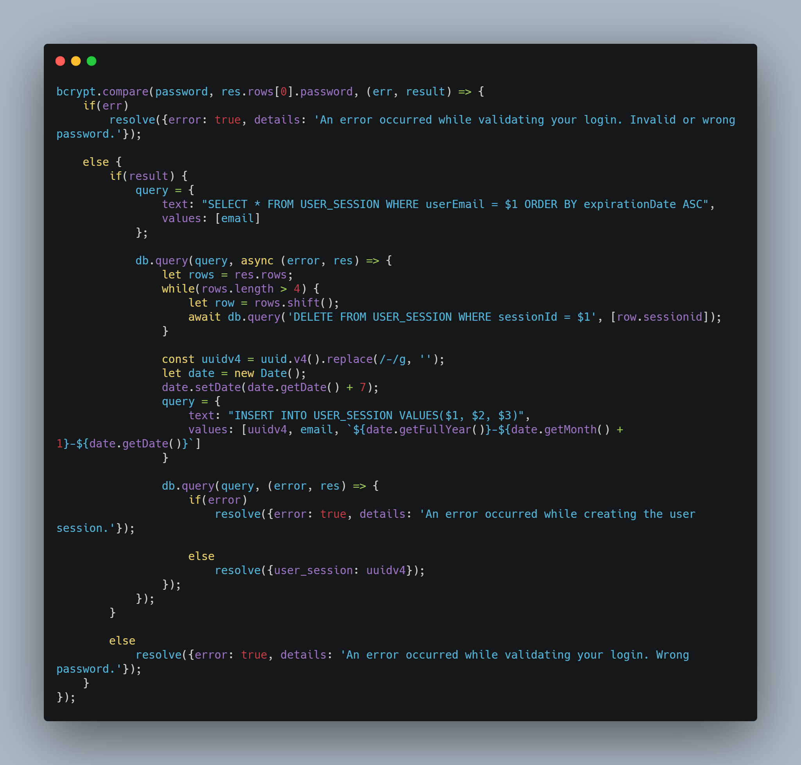

| Data |Versão| Autor | Descrição |
| ---- | ---- | ----- | --------- |
| 2020/11/17 | 0.1 | Eduardo Lima | Criação do Documento |
| 2020/11/17 | 0.2 | Larissa Sales | Adição de descrição e Referências |
| 2020/11/17 | 0.3 | Eduardo Lima | Adição de links para arquivos citados |
| 2020/11/17 | 0.4 | Luis Taira | Adição de Mocha e Chai |
| 2020/11/17 | 0.5 | Eduardo Lima | Adição do tópico getUser |
| 2020/11/18 | 0.6 | Samuel Pereira | Adição do Crawler |
| 2020/11/18 | 0.7 | Samuel Pereira | Atualização do Crawler |
| 2020/11/18 | 0.8 | Samuel Pereira | Adição do Bcrypt |

# Reutilização de Software - Backend

## Node.js

Para a implementação do Backend utilizamos o Nodejs. Nodejs é um runtime assíncrono orientado a eventos em JavaScript, feito para criar aplicações network escaláveis, possuindo uma vasta variedade de frameworks, possibilitando um desenvolvimento rápido e de qualidade com a reutilização de software.

Utilizamos a reutilização de software através de frameworks e serviços em nosso backend. São eles:

## Express 

Framework de aplicação web para NodeJs, utilizado para criar API de maneira eficiente.

* Hot-spot: Possuímos implementado em nossa aplicação o método Router do express, que possibilita a criação dinâmica de rotas HTTP

    

    [Router.js](https://github.com/UnBArqDsw/2020.1_G3_RecipeBuk_Backend/blob/dev/src/routes/Router.js)

* Frozen-spot: Inicializar uma aplicação web via Express
        
    

    [index.js](https://github.com/UnBArqDsw/2020.1_G3_RecipeBuk_Backend/blob/dev/index.js)

## getUser

getUser é um método existente no repositório [UserRepository.js](https://github.com/UnBArqDsw/2020.1_G3_RecipeBuk_Backend/blob/dev/src/Repository/UserRepository.js), sendo aplicado como um serviço de autenticação reutilizado em todo o Backend. Sua função é lidar com a verificação do token de autenticação do usuário , além de retornar suas informações. Atua como Frozen-spot.

Exemplo de aplicação no arquivo [BookRoutes.js](https://github.com/UnBArqDsw/2020.1_G3_RecipeBuk_Backend/blob/dev/src/routes/BookRoutes.js)

## Mocha e Chai

São duas bibliotecas que tranalham em conjunto e permitem a criação de testes unitários da aplicação.
Quando rodado o comando `npm test`, são rodados todos os testes específicados.

Segue um exemplo da utilizalção no projeto

[crawlerTest.js](https://github.com/UnBArqDsw/2020.1_G3_RecipeBuk_Backend/blob/dev/src/tests/crawlerTest.js)

## Crawler
Crawler é um módulo para NodeJS que tem como funcionalidade a realização de Web Scraping e Web Crawling, permitindo a obtenção de informações de páginas da web de forma sistematizada.  

No ponto de vista de reutilização de software do Crawler no Recipebuk, a utilização do Crawler simplifica o desenvolvimento do projeto pois justamente fornece essas funcionalidades de *Web Scraping* e *Web Crawling*, a qual é utilizada no projeto para a obtenção da informações de receitas de diversos websites. A ausência desse módulo, ocasionaria na necessidade de implementação das seguintes funcionalidades:
- Obtenção de informações de páginas através de requisições HTTP;
- *Parsing* das informações adquiridas, a qual é resolvido pelo Crawler através da disponibilização do Cheerio, uma implementação simplificada do JQuery para servidores;
- Agendamento e sincronização de todas as requisições para o fornecimento da resposta do servidor, onde o Crawler soluciona através do fornecimento de uma fila de requisições a qual possui um callback quando todas as requisições são finalizadas e processadas.  

No projeto, o Crawler atua como uma reutilização de código de caixa-branca, pois utilizamos a funcionalidade de *scraping* para adquirir informações de outros sites, a qual temos de definir como será feita a filtragem de dados em cada um dos websites alvos. Exemplo da utilização segue abaixo: 

- Hot spot: Implementação de tratamento de dados do website TudoGostoso

[Crawler.js](https://github.com/UnBArqDsw/2020.1_G3_RecipeBuk_Backend/blob/dev/src/models/Crawler.js)
 
## Bcrypt
Bcrypt é um módulo para NodeJS que tem como funcionalidade a realização de criptografias do tipo hash através do algoritmo bcrypt.  

No ponto de vista de reutilização de software do Bcrypt no Recipebuk, utilizar este módulo poupa os desenvolvedores de implementarem uma série de funcionalidades, sendo essas:
- A implementação do algoritmo de hash bcrypt;
- A implementação de funções auxiliares, como a de geração de sal;
- A implementação de funções que utilizam o algoritmo bcrypt para gerar as hashes;
- A implementação de funções para a validação de strings com alguma hash específica.

No projeto, o Bcrypt atua como uma reutilização de código de caixa-preta, logo que consumimos uma programação pronta, sem fornecer qualquer código ao mesmo, com exceção de callbacks, e as informações que o mesmo deve utilizar. Segue abaixo, exemplos da utilização do Bcrypt no projeto: 

- Frozen spot: Utilização do módulo Bcrypt para gerar hashes durante a realização de cadastros de usuário

[UserRepository.js](https://github.com/UnBArqDsw/2020.1_G3_RecipeBuk_Backend/blob/dev/src/Repository/UserRepository.js)

- Frozen spot: Utilização do módulo Bcrypt para validar strings de senha

[UserRepository.js](https://github.com/UnBArqDsw/2020.1_G3_RecipeBuk_Backend/blob/dev/src/Repository/UserRepository.js)
 
 
# Referências

[1] Introdução Express/Node. Disponível em: <<https://developer.mozilla.org/pt-BR/docs/Learn/Server-side/Express_Nodejs/Introdu%C3%A7%C3%A3o>>. Acesso em: 17 nov. 2020.
