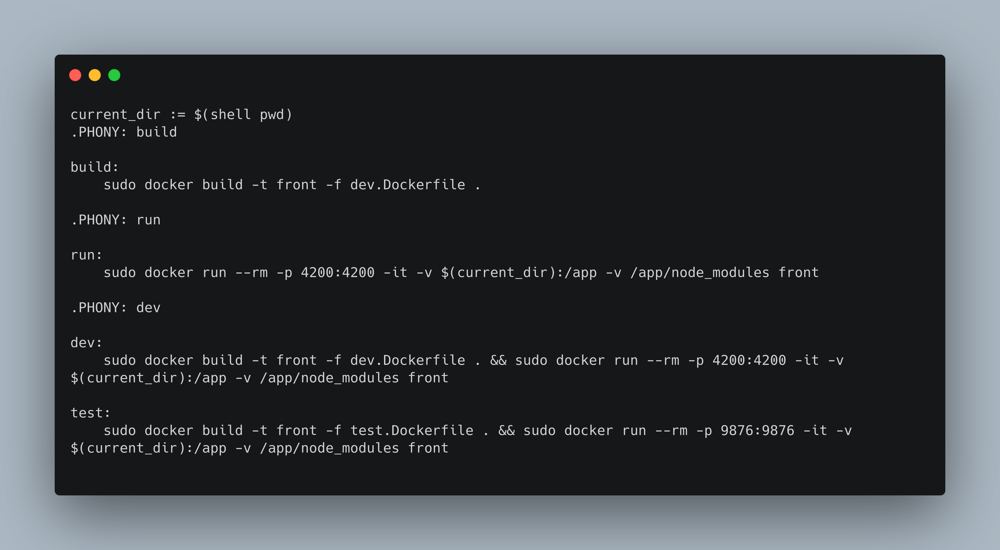
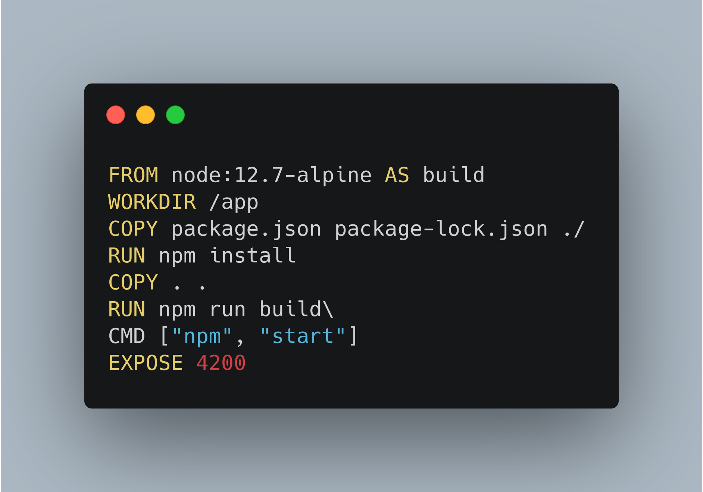
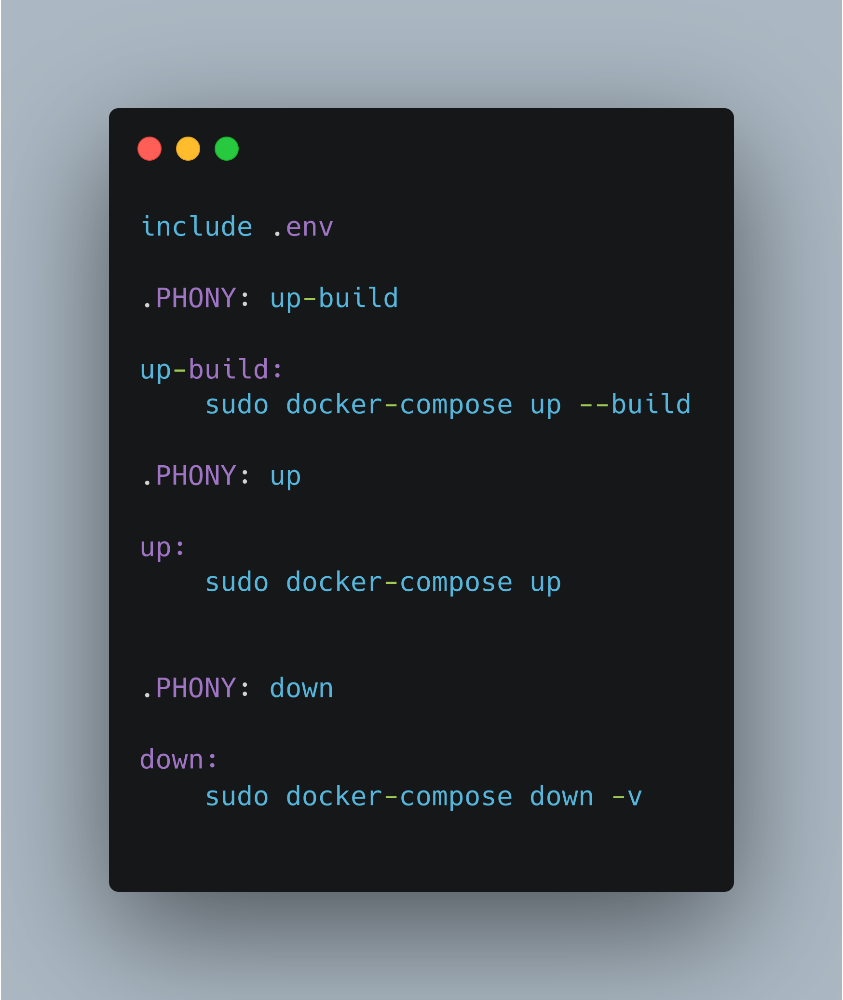
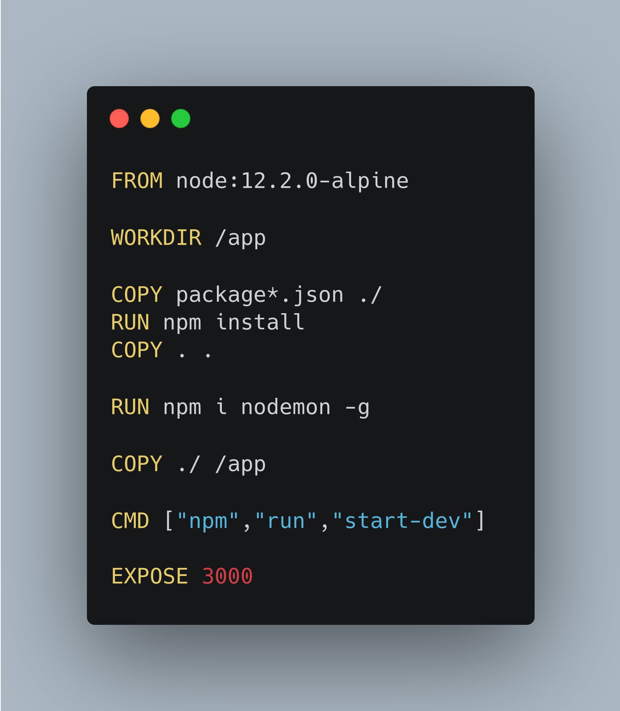
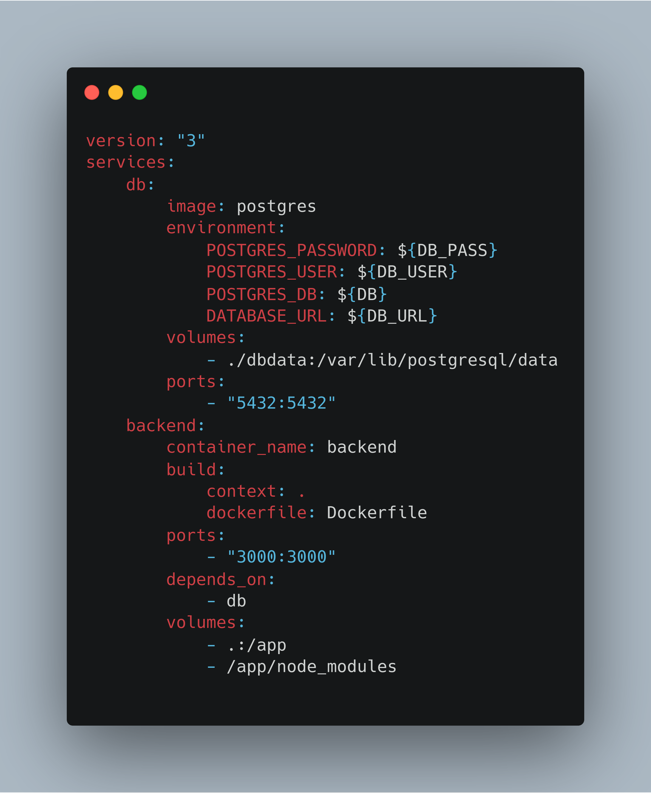

| Data |Versão| Autor | Descrição |
| ---- | ---- | ----- | --------- |
| 2020/11/16 | 0.1 | Luis Henrique | Criação do Documento |
| 2020/11/17 | 1.0 | Luis Henrique | Mudança do tamanho das imagens |

# Docker

Antes de começar o desenvolvimento do Recipebuk, os repositórios do Frontend e Backend foram dockerizados.

Docker é uma plataforma utilizada para isolar a execução de programas em máquinas virtuais mínimas e padronizadas, chamadas de containers. Ao executar um programa por meio de docker ele roda dentro de um container, que ao ser criado tem todas as dependências instaladas fácilmente e automaticamente, sem que o desenvolvedor tenha que se preocupar ou gastar tempo com a preparação de seu ambiente de desenvolvimento.

A utilização de docker é muito útil e, para algumas organizações, imprecindível. O tempo gasto por desenvolvedores em preparar seu ambiente pode ser considerável, especialmente para usuários de Microsoft Windows. O docker permite que os eventos de instalação e execução sejam programados somente uma vez, por um DevOps do time, e não precisem ser executados verbosamente novamente.
Dessa forma, é evitado que todos os desenvolveres do time tenham que ficar rodando scripts de instalação manualmente e muitas vezes diagnisticando problemas de instalação e compatibilidade.

O docker é também  extremamente útil no momento de implementar a aplicação pois ele remove a camada de configuração de infra estrutura no processo e já é feito para rodar somente a sua aplicação.

## Docker no Frontend do RecipeBuk

Para facilitar ainda mais o desenvolvimento, usamos Makefile

</img>

O trabalho do docker acontece em duas etapas
1. A construção do container, que é quando ele é criado e todas as dependências são instaladas.
2. A execução do progama dentro do container.

</img>

Usando o Makefile essas duas etapas podem ser condensadas em somente um comando, no nosso caso: `make dev`, ou se quisermos executar uma etapa de cada vez: `make build` para construir o container e `make run` para rodar a aplição.

## Docker no Backend do RecipeBuk

No Backend, além de Docker e Makefile, usamos o docker-compose.

</img>

</img>

</img>

Aqui, o uso de docker e docker-compose é especialmente útil pois além da aplicação que roda em Node.js, é preciso rodar o banco de dados PostgreSQL. Normalmente seria preciso rodar simultaneamente o banco e a aplicação, mas podemos construir os containers e rodar tudo somente com o comando `make up-build`.

# Referências

[1]  ANDERSON, Charles. Docker [Software engineering]. 2015. Disponível em: <<https://ieeexplore.ieee.org/abstract/document/7093032>>. Acesso em: 16 nov. 2020.