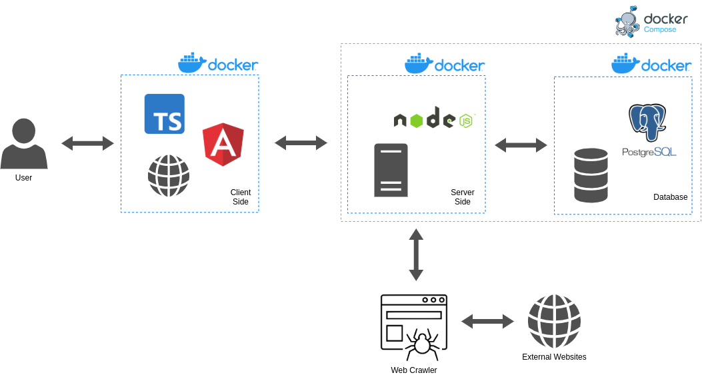
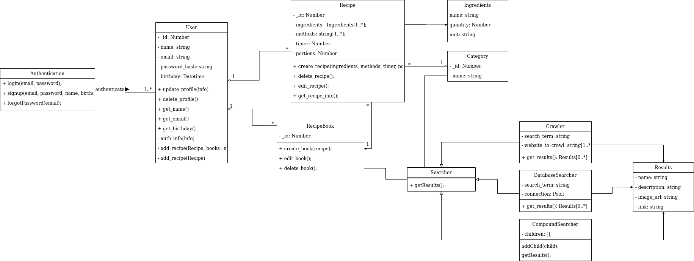
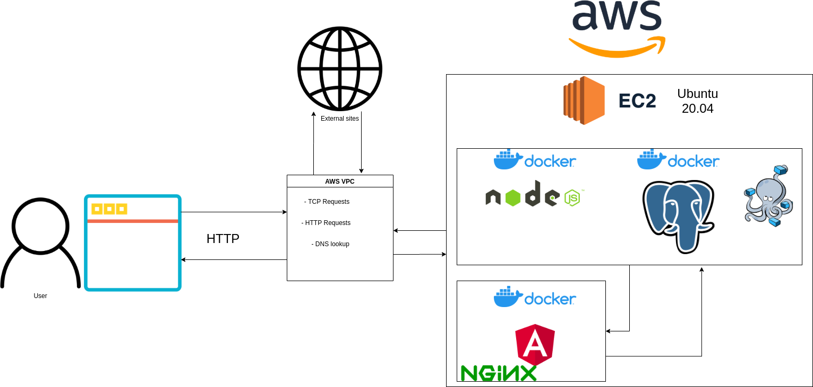

| Data |Versão| Autor | Descrição |
| ---- | ---- | ----- | --------- |
| 2020/11/18 | 0.1 | Luís Taira | Criação do modelo do documento, adição da introdução e representação arquitetural sem diagrana de relações. |
| 2020/11/19 | 0.2 | Samuel Pereira | Adição da Visão de Caso de Uso |
| 2020/11/19 | 0.3 | Samuel Pereira | Correção de links na Visão de Caso de Uso e adição de referências |
| 2020/11/19 | 0.4 | Luís Taira | Adição da Visão Geral da Visão lógica |
| 2020/11/19 | 0.5 | Luís Taira | Adição dos Diagramas de Pacotes |
| 2020/11/19 | 0.6 | Larissa Sales | Adição do Diagrama de Relações |
| 2020/11/19 | 0.7 | Larissa Sales | Adição de Tecnologias e Metas e Restrições de Arquitetura |
| 2020/11/20 | 0.8 | Letícia Araújo e Dâmaso | Adição de tópicos de qualidade, diagrama de classes e tamanho e desempenho |
| 2020/11/20 | 0.9 | Eduardo Lima | Adição do tópico Frontend para visão de implantação |
| 2020/11/20 | 0.10 | Eduardo Lima | Adição do tópico Backend para visão de implantação |
| 2020/11/20 | 0.11 | Eduardo Lima | Adição do tópico Cloud para visão de implantação e diagrama |
| 2020/11/20 | 1.0 | Luís Taira | Adição do sumário, referência e formatação |

# RecipeBuk
## Documento de Arquitetura
### Versão 1.0

## Sumário
[1. Introdução](#_1-introdução)  
&emsp; [1.1 Finalidade](#_11-finalidade)  
&emsp; [1.2 Escopo](#_12-escopo)  
&emsp; [1.3 Definições, Acrônimos e Abreviações](#_13-definições-acrônimos-e-abreviações)  
&emsp; [1.4 Referências](#_14-referências)  
&emsp; [1.5 Visão Geral](#_15-visão-geral)  
[2. Representação Arquitetural](#_2-representação-arquitetural)  
&emsp; [2.1 Diagrama de Relações](#_21-diagrama-de-relações)  
&emsp; [2.2 Representação dos Serviços](#_22-representação-dos-serviços)  
&emsp; &emsp; [2.2.1 Frontend](#_221-frontend)  
&emsp; &emsp; [2.2.2 Backend](#_222-backend)  
&emsp; [2.3 Tecnologias](#_23-tecnologias)  
&emsp; &emsp; [2.3.1 Angular](#_231-angular)  
&emsp; &emsp; [2.3.2 Node.js](#_232-nodejs)  
&emsp; &emsp; [2.3.3 PostgreSQL](#_233-postgresql)  
&emsp; &emsp; [2.3.4 Docker](#_234-docker)  
&emsp; &emsp; [2.3.5 Docker Compose](#_235-docker-compose)  
[3. Metas e Restrições da Arquiteura](#_3-metas-e-restrições-de-arquitetura)  
&emsp; [3.1 Restrições Tecnológicas](#_31-restrições-tecnológicas)  
&emsp; [3.2 Requisitos Não Funcionais](#_32-requisitos-não-funcionais)  
[4. Visão de Casos de Uso](#_4-visão-de-casos-de-uso)  
&emsp; [4.1. Realização de Casos de Uso](#_41-realização-de-casos-de-uso)  
[5. Visão Lógica](#_5-visão-lógica)  
&emsp; [5.1. Visão Geral](#_51-visão-geral)  
&emsp; [5.2. Pacotes de Design Significativos do Ponto de Vista da Arquitetura](#_52-pacotes-de-design-significativos-do-ponto-de-vista-da-arquitetura)  
&emsp; [5.3. Visão da Implantação](#_53-visão-da-implantação)  
&emsp; [5.3.1 Frontend](#_531-frontend)  
&emsp; [5.3.2 Backend](#_532-backend)  
&emsp; [6. Tamanho e Desempenho](#_6-tamanho-e-desempenho)  
&emsp; [7. Qualidade](#_7-qualidade)  
&emsp; [7.1 Precisão](#_71-precisão)  
&emsp; [7.2 Confiabilidade](#_72-confiabilidade)  
&emsp; [7.3 Eficiência](#_73-eficiência)  
&emsp; [7.4 Integridade](#_74-integridade)  
&emsp; [7.5 Usabilidade](#_75-usabilidade)  
&emsp; [7.6 Manutenibilidade](#_76-manutenibilidade)  
&emsp; [7.7 Testabilidade](#_77-testabilidade)  
&emsp; [7.8 Flexibilidade](#_78-flexibilidade)  
&emsp; [7.9 Portabilidade](#_79-portabilidade)  

## 1. Introdução
### 1.1 Finalidade
Este documento tem como finalidade fornecer uma visão geral da arquitetura do RecipeBuk, utilizando-se de diversas visões arquiteturais a fim de facilitar o entendimento dos processos e funcionamento de todo o sistema. Tem também como objetivo transmitir as decisões arquiteturais significativas tomadas em relação ao mesmo.

### 1.2 Escopo

&emsp;&emsp;Através desse documento, é possível obter um melhor entendimento da arquitetura do RecipeBuk, permitindo ao leitor compreender o funcionamento de seu sistema, como também a abordagem utilizada para o seu desenvolvimento.

### 1.3 Definições, Acrônimos e Abreviações
### 1.4 Referências
[1] SCHMIDT, David. Lecture 7: Use cases and diagrammatic realizations. Disponível em: <http://people.cs.ksu.edu/~schmidt/501s13/Lectures/Lecture07S.html>. Acesso em: 19, Novembro, 2020. 

[2] IBM Corp. Diretriz: Realização de Casos de Uso. Disponível em: <https://www.cin.ufpe.br/~gta/rup-vc/core.base_rup/guidances/guidelines/use-case_realization_C690D81F.html>. Acesso em: 19, Novembro, 2020. 

[3] IBM Corp. Artefato: Realização de Casos de Uso. Disponível em: <https://www.cin.ufpe.br/~gta/rup-vc/core.base_rup/workproducts/rup_use_case_realization_E4F713BD.html>. Acesso em: 19, Novembro, 2020.  

[4] PAVÓN, Judith. Engenharia de Requisitos. 2012. 51 slides. Disponível <<https://pt.slideshare.net/computacaodepressao/aula3-engenharia-requisitos-15925876>> Acesso em: 19 de nov de 2020.

[5] GUEDES, Marylene. Treinaweb. O que é o Angular e para que serve? Disponível em: <<https://www.treinaweb.com.br/blog/o-que-e-o-angular-e-para-que-serve/>> Acesso em: 20 de nov de 2020.

[6] LENONS. Opus Software. Node.js - O que é, como funciona e quais as vantagens. Disponível em: <<https://www.opus-software.com.br/node-js/>>. Acesso em: 20 de nov de 2020.

[7] PostgreSql. Disponível em: <<https://www.postgresql.org/>>. Acesso em: 20 de nov de 2020.

[8] SOUZA, Ivan de. Rock Content. PostgreSQL: saiba o que é, para que serve e como instalar. Disponível em: <<https://rockcontent.com/br/blog/postgresql/>>. Acesso em: 20 de nov de 2020.

[9] geekhunter. Como construir uma aplicação com Docker? Disponível em: <<https://blog.geekhunter.com.br/docker-na-pratica-como-construir-uma-aplicacao/>>. Acesso em: 20 de nov de 2020.

[10] TRUCCO, Cristian. iMasters. Docker Compose: O que é? Pra que serve? O que come? Disponível em: <<https://imasters.com.br/banco-de-dados/docker-compose-o-que-e-para-que-serve-o-que-come>>. Acesso em: 20 de nov de 2020.

[11] INTERNATIONAL ORGANIZATION FOR STANDARDIZATION. Systems and Software Engineering: Systems and software Quality Requirements and Evaluation (SQuaRE). Disponível em: <<https://www.iso.org/obp/ui/#iso:std:iso-iec:25000:ed-2:v1:en>>. Acesso em: 20 nov. 2020.

[12] NAIK, Kshirasagar et al. Software Quality. In: NAIK, Kshirasagar; TRIPATHY, Priyadarshi. Software Testing and Quality Assurance: theory and practice. New Jersey: John Wiley & Sons, 2008. p. 1-648.

[13] Gaia - Documento de arquitetura. Disponível em: <<https://fga-eps-mds.github.io/2019.1-Gaia/#/projeto/DocArquitetura>>. Acesso em: 20 set. 2020.

### 1.5 Visão Geral

&emsp;&emsp;Este documento apresenta, de forma detalhada, a arquitetura, os requisitos e as decisões tomadas a respeito do RecipeBuk.

&emsp;&emsp;O documento está estruturado da seguinte maneira:

<ul>
<li>Histórico da Revisão: Responsável por deixar explícito cada alteração feita no documento e as informações a respeito do mesmo;</li>
<li>Introdução: Fornece uma visão geral do documento inteiro;</li>
<li>Representação arquitetural: Descreve qual é a arquitetura de software do sistema atual e como ela é representada;</li>
<li>Metas e restrições da arquitetura: Descreve os requisitos e objetivos do software que têm algum impacto sobre a arquitetura;</li>
<li>Visão de Caso de Uso: Descreve os casos de uso do sistema representando suas funcionalidades centrais; </li>
<li>Visão Lógica: Descreve as partes significativas do ponto de vista da arquitetura do modelo de design;</li>
<li>Visão de Processos: Descreve a decomposição do sistema em processos leves e
processos pesados;</li>
<li>Visão de Implantação: descreve uma ou mais configurações da rede física na qual o software é implantado e executado;</li>
<li>Visão de Implementação: descreve a estrutura geral do modelo de implementação, a divisão do software em camadas e os subsistemas no modelo de implementação e todos os componentes significativos do ponto de vista da arquitetura;</li>
<li>Visão de Dados: descreve a perspectiva de armazenamento de dados persistentes do sistema;</li>
<li>Tamanho e Desempenho: descreve as principais características de dimensionamento do software que têm um impacto na arquitetura, bem como as restrições do desempenho desejado;</li>
<li>Qualidade: descreve como a arquitetura do software contribui para todos os recursos (exceto a funcionalidade) do sistema.</li>
</ul>

## 2. Representação Arquitetural
### 2.1 Diagrama de Relações

Autor: Larissa Sales

&emsp;&emsp;O estilo arquitetural cliente-servidor visa implementar uma aplicação dividindo-a em dois serviços, um cuja implantação distribui um módulo para os clientes, que se tornam responsáveis por sua execução e outro que tem seus processos executados em um servidor e se comunica com os clientes, geralmente por requisições HTTP.

&emsp;&emsp;Cada um dos serviços do RecipeBuk terá seu próprio repositório. Destacando assim, mais uma característica desse estilo arquitetural, onde cada um deles terá seu próprio ambiente, tecnologias, integração contínua e deploy.

&emsp;&emsp;Os serviços que serão implementados no RecipeBuk foram pensados para distribuir as responsabilidades e interesses entre o cliente e o servidor. São os serviços:

<ul>
<li>Frontend;</li>contêineres
<li>Backend.</li>
</ul>

### 2.2 Representação dos Serviços

#### 2.2.1 Frontend

&emsp;&emsp;O Frontend do RecipeBuk é responsavel por toda a interação com o usuário. Ele apresenta uma interface gráfica que habilita o usuário a usar todas as funções do sistema.

&emsp;&emsp; Interagindo com o Frontend o usuário terá acesso ao núcleo das funcionalidades do RecipeBuk, sendo elas principalmente: fazer pesquisas por receitas e adicionar os resultados aos favoritos, criar uma conta e fazer login, criar livros de receitas, adicionar, editar e remover receitas e visualizar os livros, receitas e receitas favorias.

#### 2.2.2 Backend

&emsp;&emsp; O Backend do RecipeBuk é o responsável pela funcionalidade das principais características do sistema. Através de requisições feitas pelo Frontend, o Backend irá realizar as pesquisas feitas pelo usuário, armazenar e editar contas de usuários, receitas, lista de favoritos e livros e realizar a autenticação de usuários.

### 2.3 Tecnologias

#### 2.3.1 Angular

Angular é um framework de desenvolvimento frontend, _open-source_ para aplicações para web, mobile ou desktop. Com ele é possível a construção de uma SPA (_Sigle Page Applications_) de forma dinâmica e escalável.

#### 2.3.2 Node.js

Sua arquitetura permite ainda uma maior facilidade de implementação de Microsserviços e componentes de arquitetura _Serveless_. 

#### 2.3.3 PostgreSQL

O PostgreSQL é um gerenciador de banco de dados relacionais que proporciona forte confiabilidade, robustez de recursos e desempenho.

#### 2.3.4 Docker

Docker é uma plataforma, _open-source_ para criação, execução e _deploy_ de contêineres. Esses contêineres são pacotes da aplicação contendo suas dependências, bibliotecas e arquivos de configuração.

#### 2.3.5 Docker Compose

Docker Compose é um orquestrador de contêineres Docker. Com ele é possível gerenciar vários contêineres de uma única vez, definindo o comportamente de cada um deles.

## 3. Metas e Restrições de Arquitetura

### 3.1 Restrições Tecnológicas

Para o desenvolvimento do RecipeBük serão utitilizados as seguintes tecnologias:

- Angular: Framework de frontend para a criação de webpages;

- TypeScript: Linguagem para desenvolvimento com Angular;

- Node.js: Ambiente de execução server side;

- JavaScript: Linguagem utilizada em conjunto com o Node.js;

- PostgreSQL: Sistema de gerenciamento de banco de dados relacional;

- Docker: Ambiente de empacotamento da aplicação;

- Docker Compose: Orquestrador de contêineres Docker.

### 3.2 Requisitos Não Funcionais

- O sistema deve ser capaz de ser executado em qualquer navegador;

- O sistema deve ser capaz de buscar receitas em outros sites de receitas da internet;

- O sistema deve ser intuitivo para o usuário;

- O sistema deve persistir os dados de login do usuário;

- O sistema deve ser desenvolvido em Angular (_frontend_), Node.js (_backend_) e com banco de dados em PostgreSQL;

- O sistema deve ser desenvolvido seguindo as metodologias ágeis.

## 4. Visão de Casos de Uso

&emsp;&emsp;A documentação de caso de uso busca especificar o comportamento do sistema do ponto de vista do usuário. Todos os casos de uso produzidos se encontram disponíveis na <a href="#/04-modelagem/casos-de-uso.md">seção de modelagem da documentação</a>, sendo os que representam as funcionalidades centrais os que seguem:

- [Caso de Uso 05: Criação de receita](04-modelagem/casos-de-uso/05.md)
- [Caso de Uso 06: Criação de livro](04-modelagem/casos-de-uso/06.md)
- [Caso de Uso 07: Adição de receita à livro](04-modelagem/casos-de-uso/07.md)
- [Caso de Uso 08: Favoritar receita](04-modelagem/casos-de-uso/08.md)
- [Caso de Uso 09: Pesquisa de receita](04-modelagem/casos-de-uso/09.md)

### 4.1 Realização de Casos de Uso

&emsp;&emsp;Enquanto um caso de uso descreve o comportamento de uma funcionalidade do ponto de vista do usuário, ainda existe o ponto de vista da máquina, ou seja, do sistema. Ao incluir o ponto de vista da máquina no caso de uso, estamos criando uma realização de caso de uso, sendo uma documentação útil para guiar a construção de um sistema o qual consegue alcançar o comportamento desejado. Dessa forma, foram produzidos realizações de caso de uso para os casos de uso considerados representantes das funcionalidades centrais do RecipeBuk, os quais já foram mencionados anteriormente. Com o intuito de não poluir o documento de arquitetura, segue abaixo os hiperlinks para cada um das realizações de caso de uso:

- [Realização de Caso de Uso 05: Criação de receita](06-padroes-de-arquitetura/realizacao-caso-de-uso/05.md)
- [Realização de Caso de Uso 06: Criação de livro](06-padroes-de-arquitetura/realizacao-caso-de-uso/06.md)
- [Realização de Caso de Uso 07: Adição de receita à livro](06-padroes-de-arquitetura/realizacao-caso-de-uso/07.md)
- [Realização de Caso de Uso 08: Favoritar receita](06-padroes-de-arquitetura/realizacao-caso-de-uso/08.md)
- [Realização de Caso de Uso 09: Pesquisa de receita](06-padroes-de-arquitetura/realizacao-caso-de-uso/09.md)

## 5. Visão Lógica
### 5.1 Visão Geral

&emsp;&emsp;A interface do RecipeBuk com o usuáro é feita usando o framework Angular, que permite o uso de HTML e CSS para desenvolvimento gráfico e typescript para sua lógica e efeito para ser executado no lado do cliente. A plataforma Node.js é um ambiente de tempo de execução que executa código e javascript para realizar o processamento do RecipeBuk enquanto também é usado o framework Express.js para a exposição de rotas.

### 5.2 Pacotes de Design Significativos do Ponto de Vista da Arquitetura

#### 5.2.1 Diagrama de pacotes
Os diagramas de pacotes encontram-se na parte de modelagem da documentação através do link a seguir:
[Diagramas de pacotes versão 2](../04-modelagem/diagramas-pacotes-v2.md)

#### 5.2.2 Diagrama de classe

Os diagramas de classe encontram-se na parte de modelagem da documentação e pode ser conferido a seguir:

[Diagramas de Classes](../04-modelagem/diagrama-classes.md)

### 5.3 Visão da Implantação
Para a implantação do projeto utilizamos a engine de container Docker, juntamente com o orquestrador Docker-compose para entregar maior flexibilidade e desempenho independente da plataforma. O ambiente foi dividido entre Desenvolvimento e Produção, possuindo suas próprias configurações de infraestrutura.

#### 5.3.1 Frontend
Para implantar o frontend executado no framework Angular, utilizamos um container docker de duas etapas:
- Primeira etapa é responsável por compilar o projeto para as configurações de produção, visando segurança e estabilidade. Gerando um código fonte otimizado para a segunda etapa.
- Segunda etapa implementa o [Nginx](https://www.nginx.com/), um servidor leve e de alta performance para lidar com requisições http. O Nginx executa o código fonte da primeira etapa e é responsável por organizar suas requisições

#### 5.3.2 Backend
O backend do projeto é composto pela API implementada em Nodejs e o banco de dados implementado em Postgres. Para sua implantação utilizamos a seguinte estrutura:
- Container docker para executar o ambiente Nodejs com nossa API, compilando e expondo seus endpoints para consumo do frontend
- Container docker para hospedar o banco de dados Postgres. Apesar de containers docker serem stateless por natureza (não mantém o estado das aplicações após o fim de sua execução), utilizando o recurso de volumes é possível preservar os dados do banco e ainda assim utilizar de uma infraestrutura compacta e flexível.
- Orquestração dos containers via Docker compose. Para organizar os dois containers é necessário a estrtutura do compose, realizando sua subida e network de comunicação entre containers.

#### 5.3.2 Implantação em cloud
Para implantar nosso projeto com alta disponibilidade e escalabilidade utilizamos o serviço de cloud [AWS](https://aws.amazon.com/pt/). Para isto utilizamos:
- EC2 (Elastic Compute Cloud). É um serviço da AWS que oferece uma máquina para computação em cloud, executando uma imagem de sistema operacional de sua escolha. Utilizamos uma máquina t2.micro (1 CPU, 2.5 GHz,1 GiB memória) com o sistema operacional Ubuntu 20.04 64bits.
- Security Groups e VPC. Para configurar o acesso ao nosso projeto é necessário utilizar dos serviços de Security Group(Grupo de segurança) e VPC(Virtual Private Cloud). Ambos são responsáveis por lidar com o trafégo de entrada e saída da máquina EC2. Assim, criamos um Security group e VPC com regras de trafégo TCP aberto de entrada e saída para possibilitar a comunicação do projeto com o usuário e sites externos consumidos.

## 6. Tamanho e Desempenho

O tamanho do software assim como seu desempenho podem ser medidos através de métricas de resultados e qualidade. Sobre o tamanho do software pode se dizer em número de linhas gerais que ele conta com cerca de 20 mil linhas de códigos contando com bibliotecas de terceiros que influenciam bastante nessa contagem e também no desempenho do software como um todo. 
Tivemos o cuidado também de pegar bibliotecas que não estavam depreciadas pelos desenvolvedores e sendo constantemente atualizadas justamente para manter o padrão e qualidade dentro do software. Além de que são bibliotecas testadas e de confiança, mostrando um desempenho satisfatório para o software durante sua execução.
Sendo uma aplicação web, não conta com a instalação do usuário sendo assim diminuindo a dependência para um bom desempenho, e conta também com deploy contínuo no frontend e backend aumentando assim o desempenho também das atualizações e manutenção do software.

## 7. Qualidade
A qualidade de software pode ser vista como uma metodologia gerencial, a qual a partir de procedimentos técnicos e documentais, sejam garantidos fatores de qualidade de alto nível, que garantem a satisfação do usuário e o atendimento aos requisitos elicitados. 

### 7.1 Precisão 
Um sistema de software deve atender aos requisitos funcionais explicitamente especificados e aos requisitos não funcionais implicitamente esperados. Se um software atende a todos os requisitos elicitados, ele é considerado preciso. O RecipeBuk foi desenvolvido com base na documentação de requisitos realizada, para a criação das issues das sprints o backlog priorizado era sempre consultado, de forma do código sempre estava alinhado com os requisitos levantados. 

### 7.2 Confiabilidade
A confiabilidade de um software pode ser definida como a menor probabilidade de falha do sistema. Para alcançar esse fator, utilizamos o Istanbul Code Coverage, onde o  seu principal objetivo é encontrar códigos não testados, dessa forma se o nosso software apresenta métricas altas, significa que foi exaustivamente testado e tem uma menor chance de falhar, tornando-se mais confiável.

### 7.3 Eficiência
A eficiência de um software é medida realizando a análise de que os recursos envolvidos são compatíveis com o nível de desempenho do software. Para diminuir a utilização de recursos físicos, o grupo decidiu pela utilização de virtualização em docker e de automatização de pipeline, dessa forma o processo de entrega de software é mais rápida, estável e eficiente. 

### 7.4 Integridade
A integridade de um software é a garantia da segurança do software, tanto para ataques externos, quanto para proteção de dados. Para garantir a integridade do nosso código, está sendo utilizado o Security Group da AWS, que atua como um firewall virtual que controla o tráfego de entrada e de saída de instâncias EC2. Foi decidido, também, utilizar bcrypt que é um método de criptografia do tipo hash para senhas baseado no Blowfish e, por fim, o UUID ou Identificador único universal está sendo utilizado para realizar a identificação única de uma informação. 

### 7.5 Usabilidade
A usabilidade é a capacidade de um software ser considerado utilizável pelos usuários Os usuários colocam muita ênfase na interface do usuário dos sistemas de software. Sem uma boa interface de usuário, um sistema de software pode falhar. Para garantir a usabilidade do software, o grupo utilizou da técnica de inteligibilidade, a qual possibilita ao usuário compreender se o software pode ser usado para tarefas e condições de uso específicas e da técnica de estética/atratividade que garante ao RecipeBuk a capacidade de atrair um potencial usuário para o sistema.

### 7.6 Manutenibilidade
A manutenibilidade é a capacidade de um software ser modificado, incluindo tanto as melhorias ou extensões de funcionalidade quanto as correções de defeitos, falhas ou erros. Para garantir a manutenibilidade do RecipeBuk, o grupo utilizou da técnica de Conformidade a qual garante que o sistema está de acordo com normas, convenções, guias de estilo ou regulamentações relacionadas à manutenibilidade de código.

### 7.7 Testabilidade
A testabilidade é usar de estratégias e estruturas de testes adequadas para procurar os possíveis erros de forma automatizada. Reduzindo possíveis retrabalhos e gasto de tempo com procura de bugs. Para garantir a testabilidade do RecipeBuk foi utilizada a técnica de Teste unitários, que garante que cada unidade do sistema será testada individualmente. 

### 7.8 Flexibilidade
A flexibilidade é a capacidade adaptação às mudanças nos requisitos de ambiente e usabilidade, sem abranger mudanças estruturais. No RecipeBuk, foram utilizadas, durante as sprints, adaptações nos contextos de requisitos e de código, para garantir a flexibilidade do sistema.

### 7.9 Portabilidade
A capacidade do sistema ser transferido de um ambiente para outro. Para garantir a portabilidade, o grupo utilizou das técnicas de adaptabilidade e Coexistência, em que o  software é adaptável e existível a diferentes ambientes sem a necessidade de ações adicionais, no caso desse projeto foram utilizados ambientes Windows e Linux.
