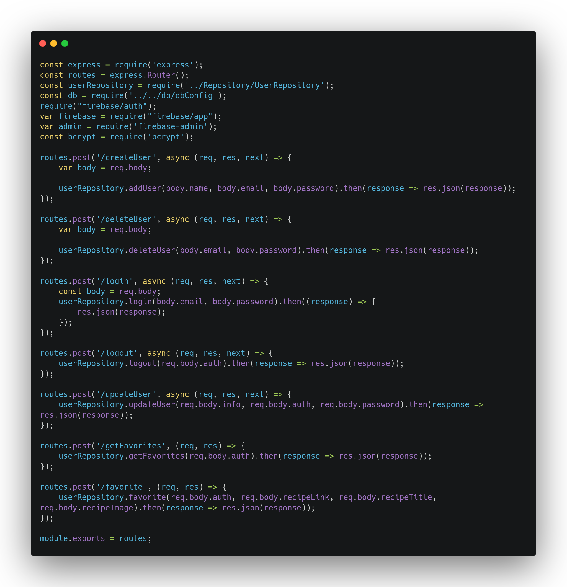

| Data |Versão| Autor | Descrição |
| ---- | ---- | ----- | --------- |
| 2020/11/14 | 1.0 | Dâmaso Júnio e Letícia Karla Araújo | Criação do Documento |

# Estilo Arquitetural
Um estilo define os tipos de elementos que podem aparecer em uma arquitetura e as regras que regem a sua interconexão. Os estilos pode simplificar o problema de definição de arquiteturas de sistema. A maioria dos sistemas de grande porte adere a vários estilos. Tem como características:

* Um estilo arquitetural representa um conjunto de escolhas de projeto, conjunto de características comuns a diversos sistemas nos quais as mesmas escolhas foram feitas;
* Estilos podem ser usados para descrever uma determinada arquitetura. O Foco nas soluções de projeto e não em sua documentação;
* Reflete a estratégia básica que é usada para estruturar um sistema.

O estilo definido pelo grupo para aplicação foi o de cliente-servidor.

## Estilo Cliente-Servidor
Arquitetura cliente-servidor ou modelo cliente-servidor é uma arquitetura na qual o processamento da informação é dividido em módulos ou processos distintos. Existe um processo que é responsável pela manutenção da informação (servidores) e outro responsável pela obtenção dos dados (os clientes).

### Papéis:
* Cliente: Solicitam um determinado serviço, através do envio de uma mensagem ao servidor. Enquanto o processo servidor está trabalhando a solicitação, o cliente está livre para realizar outras tarefas.
* Servidor: Oferecem serviços a processos usuários, ou seja, executam a tarefa solicitada e enviam uma resposta ao cliente que se traduz nos dados solicitados.

### Vantagens:
* Recursos centralizados;
* Separação de interesses;
* Maior facilidade de manutenção (Balanceamento de carga, tolerância a falhas).

### Desvantagens:
* Gerenciamento redundante em cada servidor;
* Nenhum registro central de nomes e serviços – pode ser difícil descobrir quais servidores e serviços estão disponíveis;
* Requisições e respostas casadas.

## Exemplos no Projeto

* Aplicação de Servidor no Backend

[UserRoutes.js ](https://github.com/UnBArqDsw/2020.1_G3_RecipeBuk_Backend/blob/dev/src/routes/UserRoutes.js)

* Aplicação de Client no Frontend

[account.service.ts](https://github.com/UnBArqDsw/2020.1_G3_RecipeBuk_Frontend/blob/dev/src/app/services/account.service.ts)

## Referências Blibliográficas:

[1] CORNÉLIO, Marcio; GAMA, Kiev. Estilos Arquiteturais. Disponível em: <<https://www.cin.ufpe.br/~kiev/IF682/12_Estilos_Arquiteturais_e_Padroes_de_Projeto.pdf>>. Acesso em: 14 nov. 2020.

[2] CANALTI. Arquitetura cliente-servidor. 2018. Disponível em: <<https://www.canalti.com.br/arquitetura-de-computadores/arquitetura-cliente-servidor/#:~:text=Defini%C3%A7%C3%A3o,dos%20dados%20(os%20clientes)>>. Acesso em: 14 nov. 2020.
