| Data |Versão| Autor | Descrição |
| ---- | ---- | ----- | --------- |
| 2020/11/17 | 0.1 | Samuel Pereira | Criação do documento e inclusão do Angular |
| 2020/11/17 | 0.2 | Larissa Sales | Adição de descrição e Referências |
| 2020/11/20 | 0.3 | Larissa Sales | Adição de especificações do Jasmine |
| 2020/11/20 | 0.4 | Samuel Pereira | Adição de candidatos de reutilização |
| 2020/11/20 | 0.5 | Samuel Pereira | Adição de candidato de reutilização card de livro e atualização de imagens |
| 2020/11/20 | 0.5 | Samuel Pereira | Adição de imagem faltante de favorite card na documentação |
| 2020/11/20 | 1.0 | Luís Taira | Tela de cadastro/edição de receitas |

# Reutilização de Software - Frontend

## Candidatos à reutilização
### Card de receita
&emsp;&emsp;&emsp;&emsp;Tendo em vista que visualização e acesso a receitas é uma funcionalidade básica presente no RecipeBuk, como também em outros projetos com outro contexto diferente de receitas, ter uma forma padrão e reutilizável para renderizar essas informações se torna algo de alta utilidade.  
&emsp;&emsp;&emsp;&emsp;Dessa forma, o card de receita foi transformado em um componente, como segue abaixo:
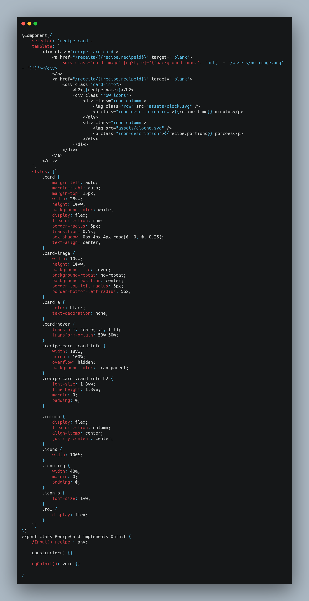
[cards.component.ts](https://github.com/UnBArqDsw/2020.1_G3_RecipeBuk_Frontend/blob/dev/src/app/cards/cards.component.ts)
 
 &emsp;&emsp;&emsp;&emsp;Este componente está sendo utilizado nas seguintes partes do projeto:
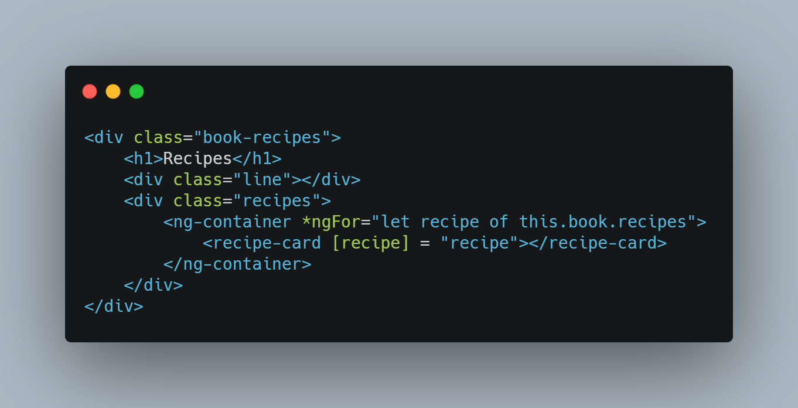
[livro.component.html](https://github.com/UnBArqDsw/2020.1_G3_RecipeBuk_Frontend/blob/dev/src/app/livro/livro.component.html)
 
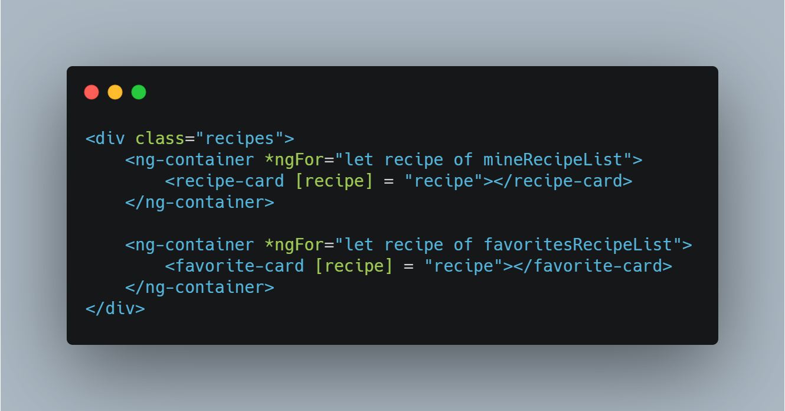
[minhas-receitas.component.html](https://github.com/UnBArqDsw/2020.1_G3_RecipeBuk_Frontend/blob/dev/src/app/minhas-receitas/minhas-receitas.component.html)

&emsp;&emsp;&emsp;&emsp;Esse componente já está sendo reutilizável no RecipeBuk da forma em que se apresenta, todavia é possível torná-lo ainda mais reutilizável ao adicionar mais parâmetros para a sua utilização, como os parâmetros de largura, altura, tamanho de fonte, entre outros, embora estes não se aplicam ao nosso contexto.

### Card de livro
&emsp;&emsp;&emsp;&emsp;Semelhante ao card de receita, o mesmo processo foi realizado com o card de livro, presente em regiões do projeto onde a visualização e acesso a livros é necessária.  
&emsp;&emsp;&emsp;&emsp;Segue abaixo como o componente de card de livro está implementado no projeto:
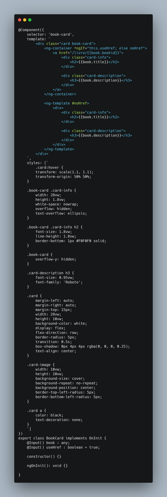
[cards.component.ts](https://github.com/UnBArqDsw/2020.1_G3_RecipeBuk_Frontend/blob/dev/src/app/cards/cards.component.ts)

&emsp;&emsp;&emsp;&emsp;Segue abaixo regiões do código em que o componente do card de livro foi utilizado:
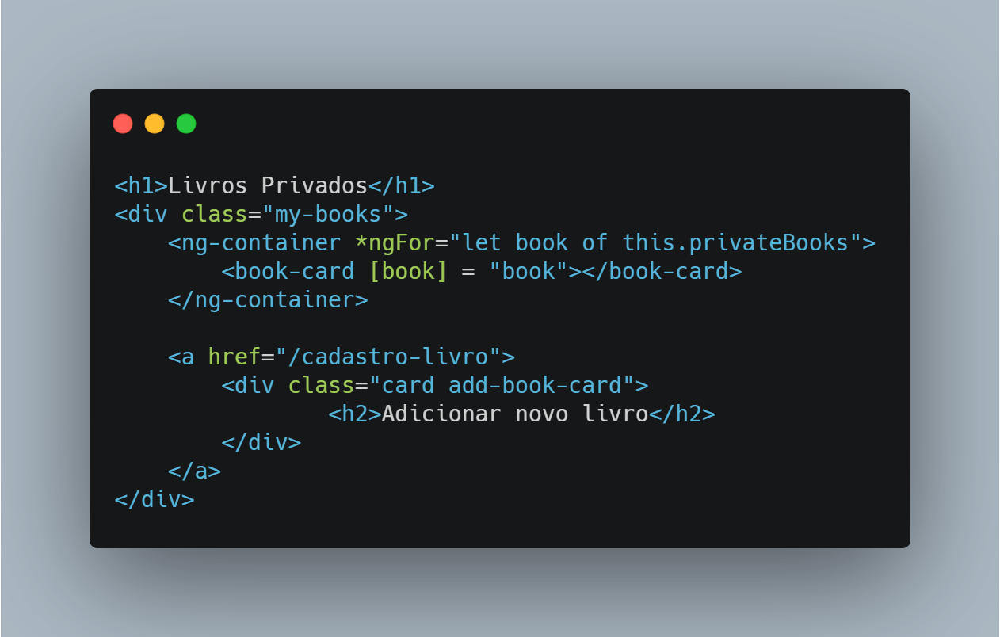
[homepage.component.html](https://github.com/UnBArqDsw/2020.1_G3_RecipeBuk_Frontend/blob/dev/src/app/homepage/homepage.component.ts)

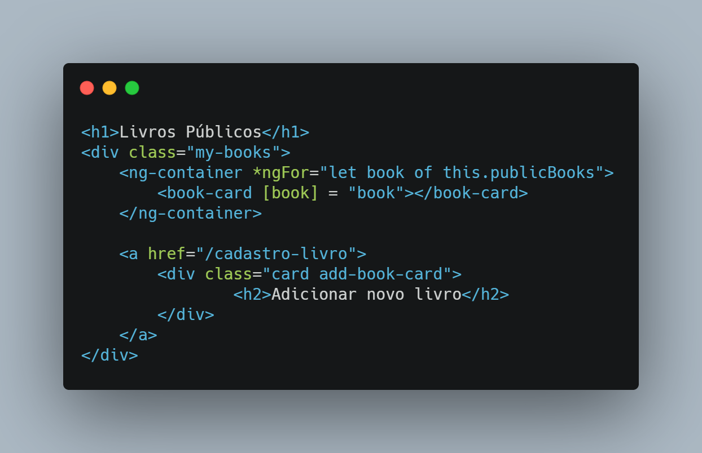
[homepage.component.html](https://github.com/UnBArqDsw/2020.1_G3_RecipeBuk_Frontend/blob/dev/src/app/homepage/homepage.component.ts)

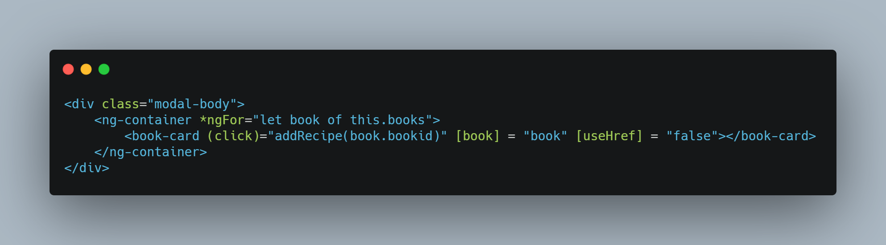
[visualizar-receitas.component.html](https://github.com/UnBArqDsw/2020.1_G3_RecipeBuk_Frontend/blob/dev/src/app/visualizar-receitas/visualizar-receitas.component.html)

### Tela de cadastro/edição de receitas
&emsp;&emsp;&emsp;&emsp; A tela de cadastro de receitas foi reutilizada para fazer também a edição de receitas

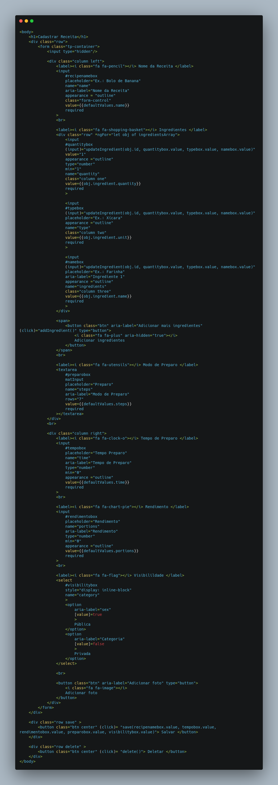
[cadastro-receitas.component.html](https://github.com/UnBArqDsw/2020.1_G3_RecipeBuk_Frontend/blob/dev/src/app/cadastro-receitas/cadastro-receitas.component.html)

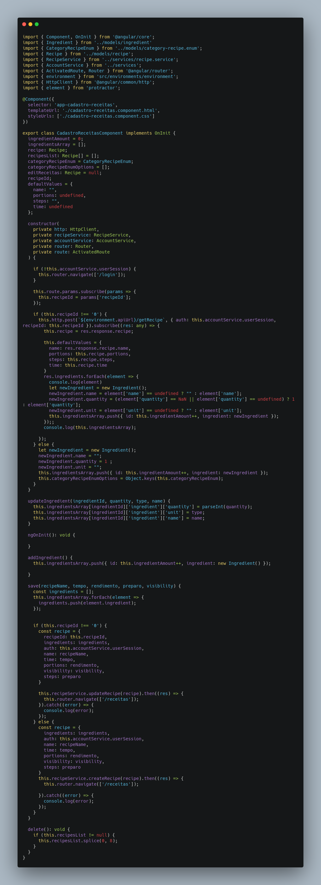
[cadastro-receitas.component.ts](https://github.com/UnBArqDsw/2020.1_G3_RecipeBuk_Frontend/blob/dev/src/app/cadastro-receitas/cadastro-receitas.component.ts)

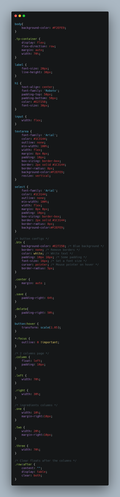
[cadastro-receitas.component.css](https://github.com/UnBArqDsw/2020.1_G3_RecipeBuk_Frontend/blob/dev/src/app/cadastro-receitas/cadastro-receitas.component.css)

### Card de favorito
&emsp;&emsp;&emsp;&emsp;Semelhante aos cards já mencionados, o mesmo processo foi realizado com o card de favoritos, podendo ser utilizado em regiões do projeto onde opções de favoritar estão disponíveis.  
&emsp;&emsp;&emsp;&emsp;No RecipeBuk, todavia, não houve a necessidade de reutilizar esse componente, embora este ainda seja um candidato. Segue abaixo a sua implementação e onde o mesmo foi utilizado:
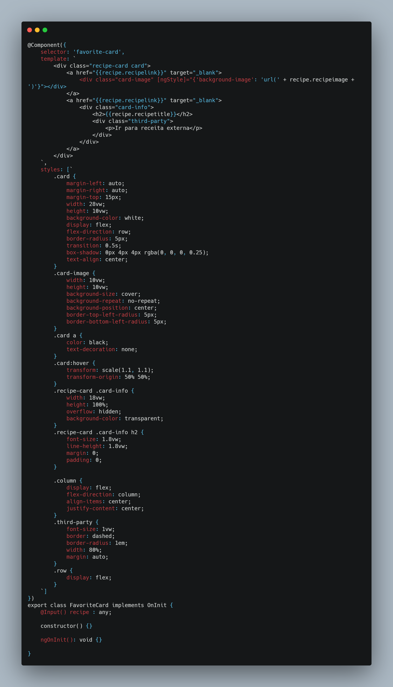
[cards.component.ts](https://github.com/UnBArqDsw/2020.1_G3_RecipeBuk_Frontend/blob/dev/src/app/cards/cards.component.ts)

[minhas-receitas.component.html](https://github.com/UnBArqDsw/2020.1_G3_RecipeBuk_Frontend/blob/dev/src/app/minhas-receitas/minhas-receitas.component.html)

## Reutilizações utilizadas

### Angular

&emsp;&emsp;&emsp;&emsp;Angular é um framework de código-aberto para desenvolvimento de aplicações web baseado em Typescript, utilizando-se de uma arquitetura de hierarquia de componentes.

&emsp;&emsp;&emsp;&emsp;No ponto de vista de reutilização de software do Angular no RecipeBük, a utilização do Angular nos poupa da implementação de funcionalidades como também simplifica a utilização das mesmas, esses sendo:
 - Implementação e facilitação da criação de elementos e páginas dinâmicas;
 - Implementação da sincronização de mudanças dos dados apresentados na view do cliente com a camada de dados do cliente e vice-versa;
 - Implementação de uma série de funcionalidades fornecidas como serviços.
 
 &emsp;&emsp;&emsp;&emsp;O framework Angular atua como uma reutilização de código de caixa-cinza, apresentando frozen spots - como os serviços que estão a disposição do usuário - e hot spots - como a arquitetura de componentes, a qual permite que o desenvolvedor crie os seus próprios componentes, como também a criação de serviços além dos serviços já nativos do Angular - apresentados com exemplo abaixo:

 - Hot spot: Implementação de componente Homepage
 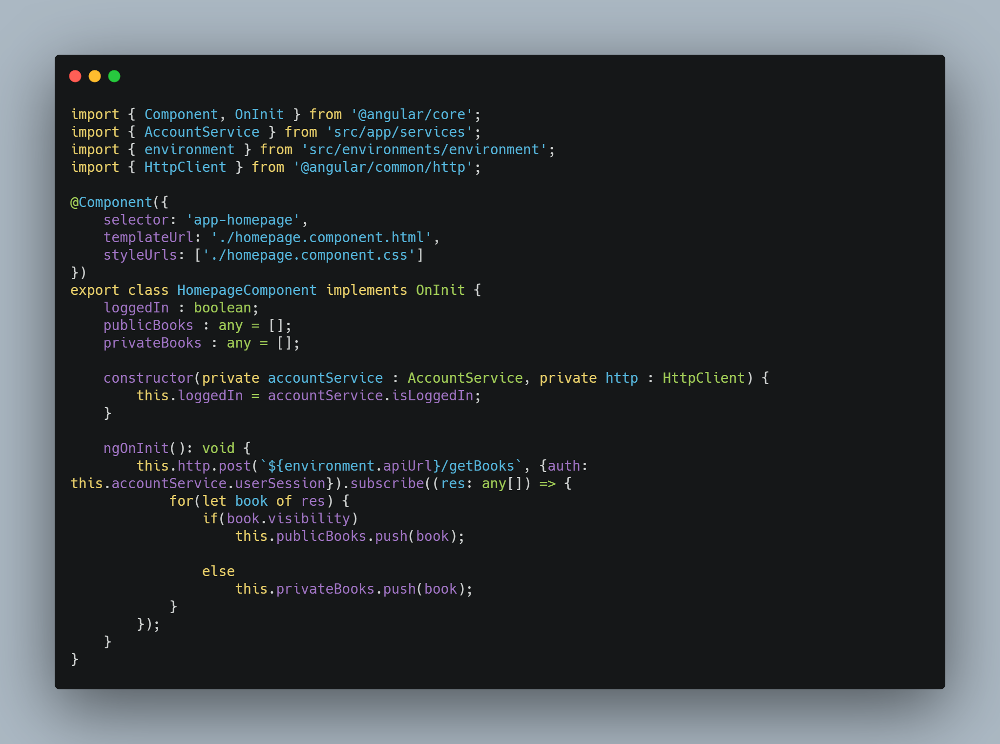
 [homepage.component.ts](https://github.com/UnBArqDsw/2020.1_G3_RecipeBuk_Frontend/blob/dev/src/app/homepage/homepage.component.ts)

 - Frozen spot: Utilização de serviço HttpClient
 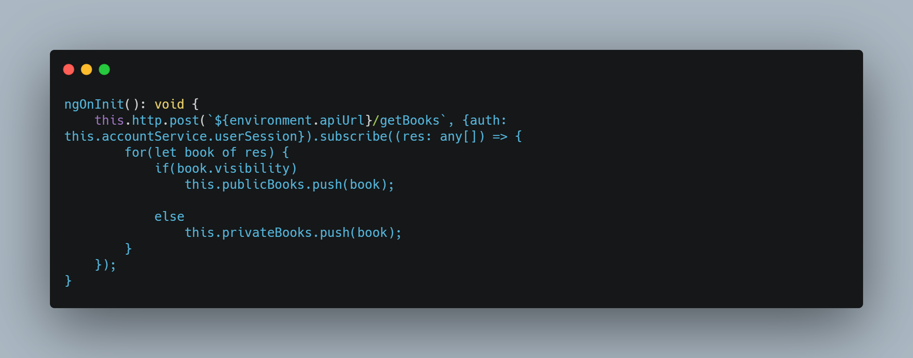
[homepage.component.ts](https://github.com/UnBArqDsw/2020.1_G3_RecipeBuk_Frontend/blob/dev/src/app/homepage/homepage.component.ts)
 
 ### Jasmine

 O Jasmine é um framework de testes unitários para código JavaScript, com suporte para a prática BDD (_Behaviour-Driven Development_).

 Seu uso nos confere uma facilidade na implementação de testes unitários, de forma que é possível utilizar um mesmo padrão de código para testar diferentes funções implementadas no código.

- Hot spot: Teste da AccountService   
 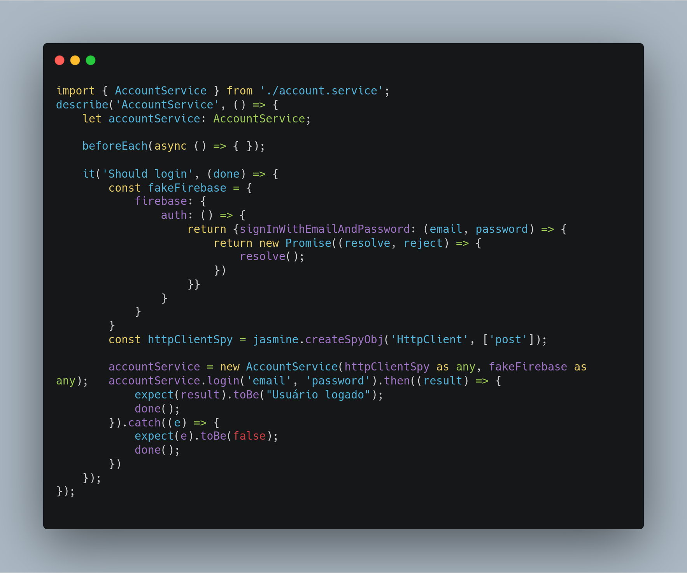
[account.service.spec.ts](https://github.com/UnBArqDsw/2020.1_G3_RecipeBuk_Frontend/blob/dev/src/app/services/account.service.spec.ts) 

 # Referências

[1] Frameworks e Padrões de Projeto. Disponível em: <<https://www.devmedia.com.br/frameworks-e-padroes-de-projeto/1111>>. Acesso em: 17 nov. 2020.

[2] ASIM. Code Craft. Jasmine & Karma. Disponível em: <<https://codecraft.tv/courses/angular/unit-testing/jasmine-and-karma/>>. Acesso em: 20 nov. 2020.
