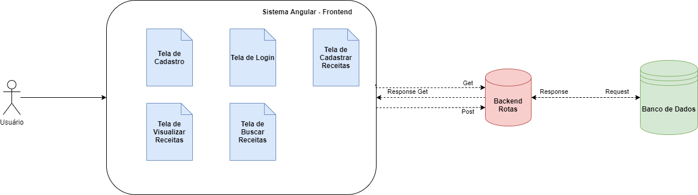

| Data |Versão| Autor | Descrição |
| ---- | ---- | ----- | --------- |
| 2020/11/14 | 1.0 | Dâmaso Júnio e Letícia Karla Araújo | Criação do Documento|

# Visão Arquitetural
A visualização Arquitetura representa uma série de casos de visualizções arquiteturais. E cada caso de visualização arquitetural trata de um conjunto específico de interesses, específicos dos envolvidos no processo de desenvolvimento: usuários, designers, gerentes, engenheiros de sistema, mantenedores e assim por diante.

## Visão Lógica
Contém a visão da a estrutura e da organização do design do sistema, uma visualização arquitetural denominada Visualização Lógica é utilizada no fluxo de trabalho Análise e Design. Existe somente uma visão lógica do sistema, que ilustra as principais realizações de caso de uso, subsistemas, pacotes e classes que abrangem o comportamento significativo em termos de arquitetura. A visão lógica é refinada durante cada iteração. A visão lógica mostra um subconjunto do modelo de design significativo em termos de arquitetura, ou seja, um subconjunto das classes, subsistemas, pacotes e realizações de caso de uso.

O grupo elaborou um caso de uso simplificado e com base em toda a estrutura atual do software, o qual se aplica nessa visão.

## Visão de Processos
Contém a organização do processo do sistema, uma visualização arquitetural, que ilustra a decomposição do processo do sistema, incluindo o mapeamento de classes e subsistemas para processos e encadeamentos. A visão de processos é refinada durante cada iteração. 

Exemplo aplicável:

O software não tem escopo para aplicação da visão de processos.
## Visão de Dados
Mapeiamento dos objetos para os dados presentes em uma visão de modelo de dados com diagramas de classe. Os quais são usados para descrever especificamente esse modelo de visão arquitetural.

[Diagrama de Dados](../04-modelagem/base-dados.md)
## Visão de Implantação

## Referências Bibliográficas
[1] PERNAMBUCO. UNIVERSIDADE FEDERAL DE PERNAMBUCO.Conceito: Visão Lógica. Dispo
nível em: <<https://www.cin.ufpe.br/~gta/rup-vc/core.base_rup/guidances/concepts/logical_view_C135365E.html>>. Acesso em: 14 nov. 2020.

[2] PERNAMBUCO. UNIVERSIDADE FEDERAL DE PERNAMBUCO. . Conceito: Visão de Processos. Disponível em: <<https://www.cin.ufpe.br/~gta/rup-vc/core.base_rup/guidances/concepts/process_view_E3DD0B09.html#:~:text=A%20vis%C3%A3o%20de%20processos%20mostra%20a%20organiza%C3%A7%C3%A3o%20do%20processo%20do%20sistema.&text=A%20arquitetura%20%C3%A9%20um%20importante,durante%20o%20desenvolvimento%20do%20sistema>>. Acesso em: 14 nov. 2020.
