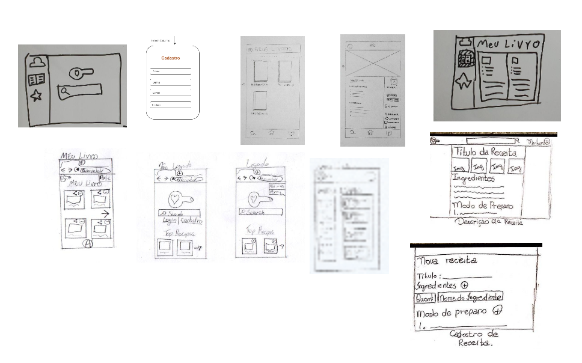

# Decision

| Data |Versão| Autor | Descrição |
| ---- | ---- | ----- | --------- |
| 2020/09/03 | 1.0 | Todos | A decisão que cola |
| 2020/09/03 | 2.0 | Dâmaso | Storyboard |
| 2020/09/03 | 2.1 | Luís | Storyboard |
| 2020/09/04 | 2.2 | Samuel | Storyboard |

## A Decisão que cola

 Foi escolhido então de cada mini-protótipo produzido, uma tela da tarefa ou visual que mais se destacava em cada um, de forma que a união de todas as ideias pudessem acarretar em um produto ideal 

## Storyboard

 Foram produzidos alguns storyboards que contêm o objetivo de mostrar casos de usos em situações reais para a nossa escolha 

- Autor: Dâmaso Júnio

- Autor: Luis Taíra

- Autor: Samuel Buters

## Referências

[1] BANQUINHA, A. **Design Sprint**, 2018. Disponível em: <<https://desenhosoftware-2018-2.github.io/wiki/>>. Acesso em: 03, Setembro, 2020.

[2] GV. **Design Sprint**, 2010. Disponível em: <<https://www.gv.com/sprint>>. Acesso em 03, Setembro, 2020.
