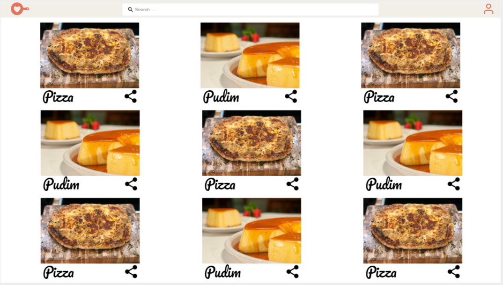
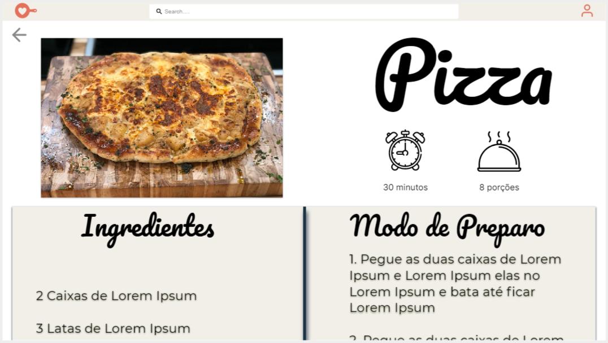
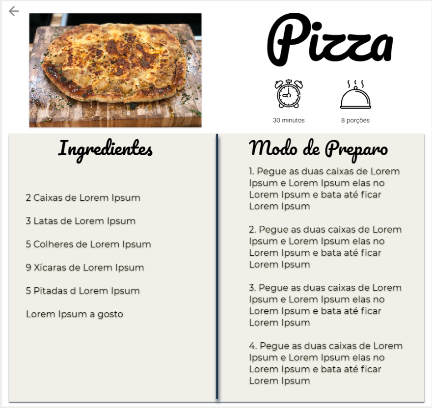

# Prototype

| Data |Versão| Autor | Descrição |
| ---- | ---- | ----- | --------- |
| 2020/09/04 | 1.0 | Dâmaso | Criação do protótipo de alta fidelidade |

## Protótipo

## Referências

[1] BANQUINHA, A. **Design Sprint**, 2018. Disponível em: <<https://desenhosoftware-2018-2.github.io/wiki/>>. Acesso em: 04, Setembro, 2020.

[2] GV. **Design Sprint**, 2010. Disponível em: <<https://www.gv.com/sprint>>. Acesso em 04, Setembro, 2020.
