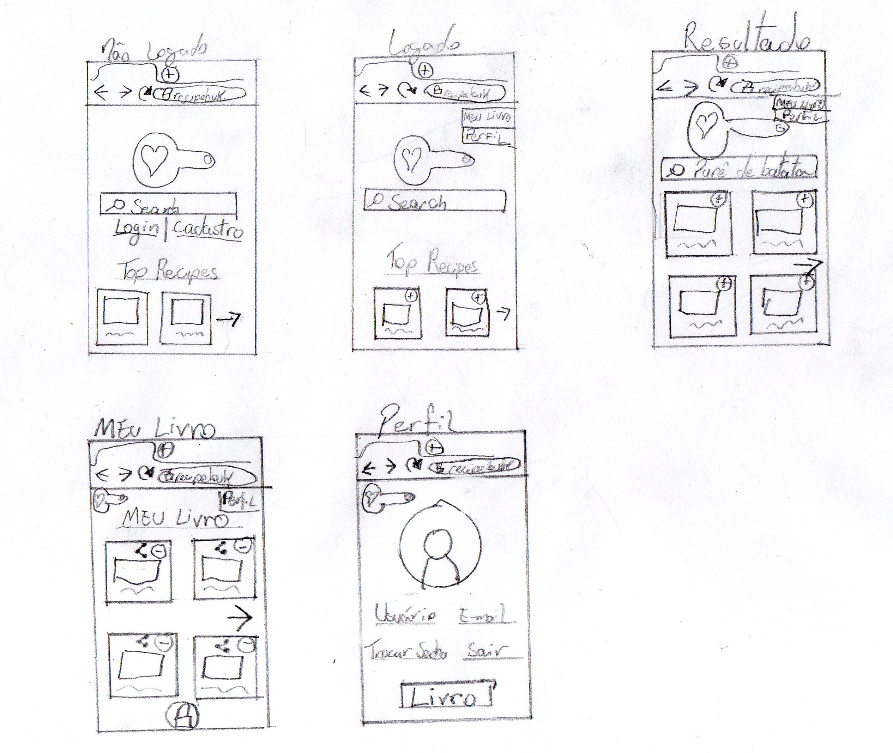
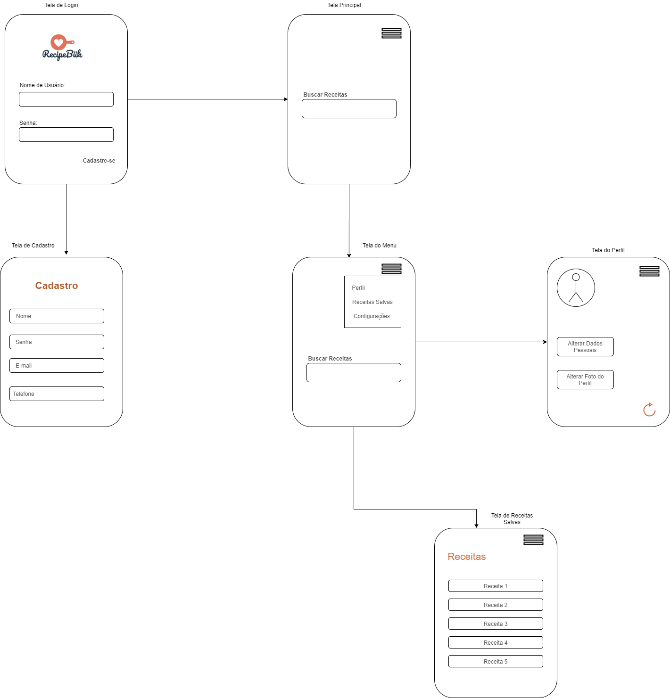

# Sketch

| Data |Versão| Autor | Descrição |
| ---- | ---- | ----- | --------- |
| 2020/08/28 | 1.0 | Dâmaso | Remapeamento do fluxo de usuários |
| 2020/08/28 | 2.0 | Dâmaso | Lightning Demo |
| 2020/08/29 | 2.1 | Luís | Lightning Demo |
| 2020/08/30 | 2.2 | Eduardo | Lightning Demo |
| 2020/08/31 | 2.3 | Samuel | Lightning Demo |
| 2020/08/31 | 2.4 | Letícia | Lightning Demo |
| 2020/09/02 | 2.5 | Larissa | Lightning Demo |
| 2020/09/03 | 2.6 | Larissa | Lightning Demo v2 |

## Mapear fluxo de usuários v2

.jpg)

 Foi repensado a forma como estava sendo imaginada o fluxo de usuários dentro da aplicação, e refeito o diagrama de fluxo 

## Lightning Demos

- Autor: Dâmaso Júnio

- Autor: Luís Taíra

- Autor: Eduardo Lima

- Autor: Samuel Buters

- Autora: Letícia Karla

- Autora: Larissa Sales

- Autora: Larissa Sales

## Referências

[1] BANQUINHA, A. **Design Sprint**, 2018. Disponível em: <<https://desenhosoftware-2018-2.github.io/wiki/>>. Acesso em: 28, Agosto, 2020.

[2] GV. **Design Sprint**, 2010. Disponível em: <<https://www.gv.com/sprint>>. Acesso em 28, Agosto, 2020.
