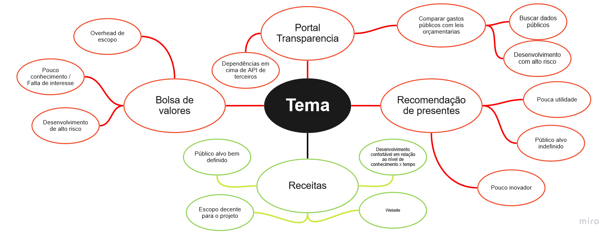

# Unpack

| Data |Versão| Autor | Descrição |
| ---- | ---- | ----- | --------- |
| 2020/08/25 | 1.0 | Todos | Definição do tema |
| 2020/08/25 | 1.1 | Dâmaso | Definição de objetivos a longo prazo |
| 2020/08/25 | 1.2 | Todos | Listar perguntas pessimistas |
| 2020/08/25 | 1.3 | Dâmaso | Definição do tema |

## Definição do tema

 Primeiramente, foi feito um brainstorm virtualmente para ser decidido o tema do projeto no qual iriamos trabalhar. Dessa forma todos apresentaram algumas e ideias, tendo pontos negativos e positivos, representados no mapa mental acima. Percebemos então que grande parte dos temas propostos tinham mais pontos negativos em relação a escopo e carga de trabalho do que positivos. Acabamos optando então pela opção que teríamos menos riscos e mais conforto ao desenvolver 

## Definir objetivos a longo prazo

 Foi definido então o objetivos a longo prazo baseado em algumas perguntas de expectativas, seguindo o modelo da <strong>GV</strong> de Design Sprint.

## Listar perguntas pessimistas

* E se o projeto não der certo? 
* E se não houverem usuários?
* E se as pessoas não souberem utilizar esses corretamente?
* E se tiver uma usabilidade ruim?
* E se a ideia for ruim?
* E se houver problemas com a infraestrutura?
* E se entrar em desuso?

## Mapear fluxo de usuários

## Referências

[1] BANQUINHA, A. **Design Sprint**, 2018. Disponível em: <<https://desenhosoftware-2018-2.github.io/wiki/>>. Acesso em: 25, Agosto, 2020.

[2] GV. **Design Sprint**, 2010. Disponível em: <<https://www.gv.com/sprint>>. Acesso em 25, Agosto, 2020.
